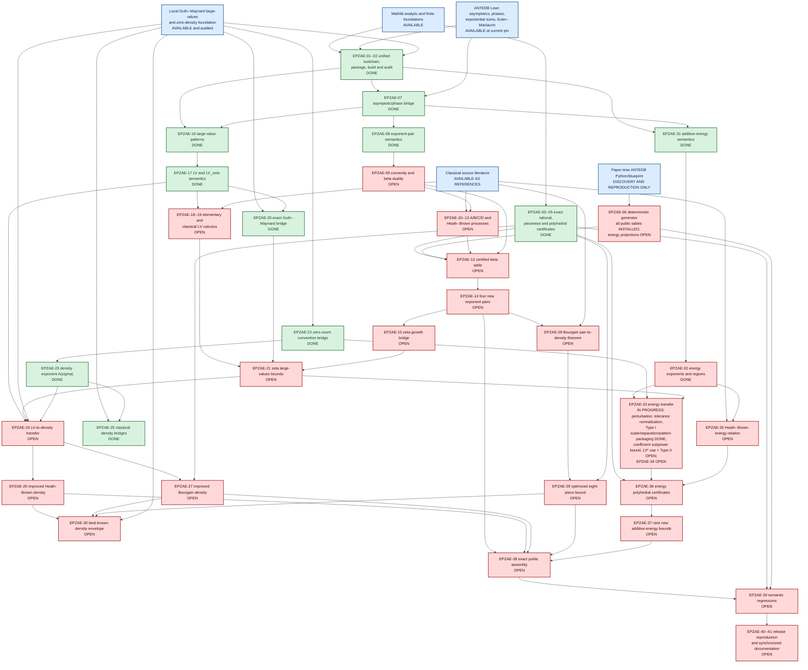

# Tao--Trudgian--Yang 2025 proof architecture

This is the canonical dependency view for the formalization. Green means the
checklist acceptance test is installed and passes the principal runner, blue
means reusable source exists but its target bridge is not yet proved, and red
means open. Checklist numbers are authoritative.



## Critical paths

The shortest useful path is:

```text
toolchain -> ANTEDB bridge -> exponent-pair semantics -> beta duality
-> exact envelope certificates -> four new exponent pairs
```

The zero-density path additionally requires large-value semantics and the
source-convention bridge to the completed Guth--Maynard work. The
additive-energy path is last because it depends on nearly the whole
large-value/zero framework and on five-dimensional projection certificates.

## Boundary rules

- `RC` proves only finite arithmetic implications. It cannot manufacture an
  analytic exponent-pair or large-value premise.
- `GMB` must consume the actual local Guth--Maynard theorem, not a separately
  supplied proposition with the desired bound.
- `ZCB` is mandatory even if both projects use the letter `N`; naming does not
  establish equality of zero-count conventions.
- `ET` must preserve the source's possibly different subsequences for
  cardinality, energy, and double-zeta exponents.
- `PUB` remains red until every advertised output has no mathematical theorem
  parameter and is present in the default build and exhaustive audit.
