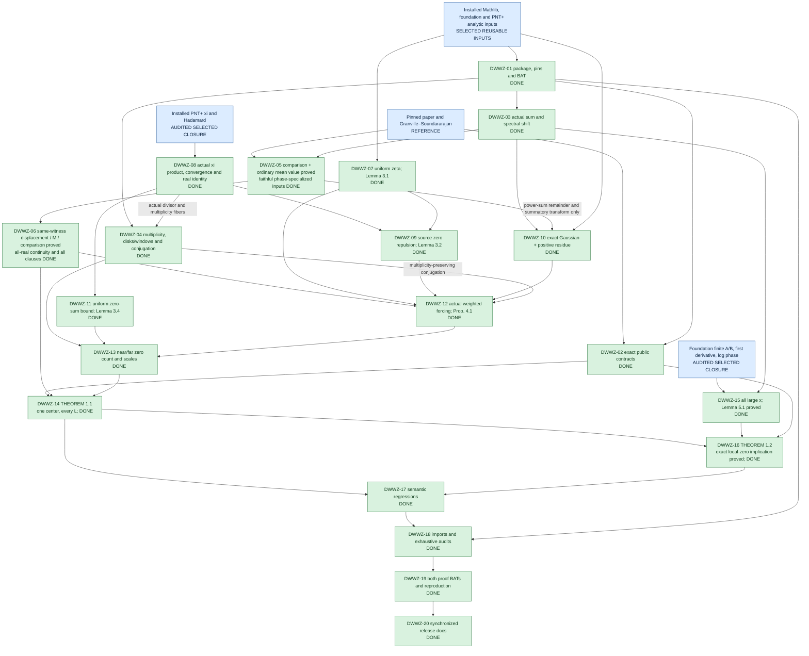

# Proof architecture

5 October 2026. PROJECT COMPLETE; 20/20 proof gates complete (DWWZ-01–20). Blue nodes are references or selected reusable inputs; the pinned foundation package graph is selected. All twenty green gates are DONE; no mathematical or release gate remains open. The map's node-71-to-node-77 relationship does not make global density a premise of the pointwise inverse theorem.

DWWZ-05 → DWWZ-06 is complete. The full DWWZ-12 consumer now compiles using completed DWWZ-04/06/07/08/09/10; DWWZ-11 is consumed by the later near/far count (DWWZ-13), not by weighted forcing; combined acceptance passed. The actual near/far count and exact T1 now compile; DWWZ-13/14 passed combined acceptance. DWWZ-15's all-large-x bound and DWWZ-16's exact T2 are now accepted after combined BAT/semantic verification. The final dependency chain is fully closed. Maximum attainment, weighted prime Cauchy–Schwarz, phase-specialized source comparison (2.2), ordinary prime-distance mean value and the exact large-sum distance clause are proved. `exists_large_sum_twist_bounds` now combines these into the same-witness displacement, distance and `(log x)^(-3/4)` comparison conclusions of Lemma 2.2. Uniform Lipschitz and the full same-witness statement are proved and audited. Full hybrid (2.1) is not claimed; the direct distance-plus-comparison deduction proves the required supporting clauses without it. Gaussian and xi identity branches are complete; zero repulsion is also complete. Actual weighted forcing has passed acceptance; the count/conjugation bridges have passed combined acceptance. Node 73 was inspected with no relevant reuse for the initial obligation, so no dependency edge or import is added.

On the Lipschitz branch, the difference-factor Poisson identity and its rightward bound now retain the initial source-line damping. Ordinary/weighted dilation Laplace identities prove the matching scale and sign for the actual cutoff sums. `TwoPointEuler` now proves reciprocal-prime cosine control with coefficient `75/113<2/3`, actual two-point zeta repulsion and the same-maximizer off-frequency estimate, with the prime scale chosen internally. The optimized dilation factor and same-maximizer rightward transport are proved. The actual weighted-difference Parseval identity and full near/far mean square are now proved. Difference smoothing is now proved in `DilationSmoothing`, with active-cutoff floor errors and only logarithmic dilation loss; the capped mean-square bound is proved. Damping-parameter assembly and its uniform power-loss evaluation are now proved in `DilationAssembly`. Scalar exponent absorption, all-real cutoff assembly and full Lemma 2.2 are kernel-checked in `DilationLipschitz` and passed both BATs. Its proved installed `MediumPNT` dependency is recorded in Dependencies; the larger node-73 quantitative-PNT interface was inspected but not imported.

On the ordinary Halász branch, installed Brun–Titchmarsh → quartic von Mangoldt mass → actual cutoff variation/cell average → exact logarithmic convolution and Abel summation proves pointwise smoothing. Bounded damping reconstruction → absolutely integrable Fubini → weighted Cauchy–Schwarz → actual near/far maximum bound → explicit minimum-integral evaluation proves `exists_maximizingTwist_mean_value_bound`. The proved Euler bound then gives `exists_maximizingTwist_prime_distance_mean_bound`; uniform error absorption and reciprocal primes give `exists_large_sum_prime_distance_bound`, with source coefficient `1/100`. Crosswalk records the constants and full ranges. The separate Lipschitz difference-smoothing input is now proved with active-cutoff control; its parameter assembly and power-loss evaluation are proved, while the final exponent, all-real cutoff assembly and full Lemma 2.2 are kernel-checked and passed combined BAT/audit acceptance. No node-73/74 import was added; the installed sieve closure is recorded in Dependencies.

Within DWWZ-05, actual summatory Laplace/Fourier/Parseval identities and convergence are proved for both the original coefficients and their logarithmic weights, giving `ζ(s−it)/s` and `−ζ′(s−it)/s`. The von Mangoldt mean square and actual-maximizer near-frequency estimate are proved. Foundation-backed individual-block estimates are retained. Exact Gaussian Gram/row bounds and dominated convergence prove the sharp **full-series** mean square and two-sided far tail, with no coefficient-block loss. Half-plane Poisson reproduction transports the original maximizer rightward; near/far assembly and Parseval supply the consumed weighted-summatory mean square. The ordinary mean-value/distance route uses the full series directly, so it has no remaining smooth-number convention bridge. The optimized factor now feeds the actual weighted-difference Parseval/mean-square consumer. Difference smoothing is proved; damping-parameter assembly and power-loss evaluation are proved. Uniform exponent absorption, all-real cutoff assembly and full Lemma 2.2 are kernel-checked. DWWZ-05/06 are DONE after both BATs and the semantic audit passed. The separate residue-bearing DWWZ-10 identity now compiles, with both source integrals proved absolutely convergent; combined BAT/audit and semantic acceptance passed.
