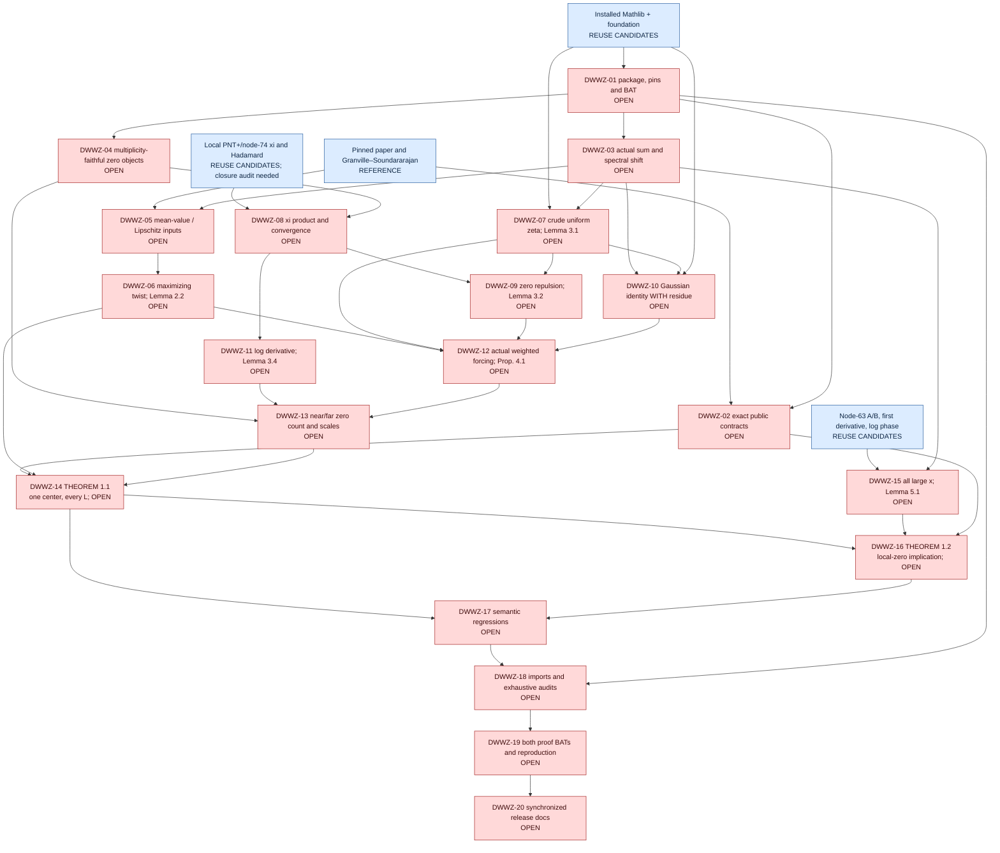

# Planned proof architecture

4 October 2026. PLANNING ONLY; 0/20 proof gates complete. Blue nodes are available references or reuse candidates, **not audited node-77 dependencies**. Every red node is an OPEN checklist gate. The map's node-71-to-node-77 relationship does not make global density a premise of the pointwise inverse theorem.

The live analytic priority after activation is DWWZ-05 → DWWZ-06 → DWWZ-12. Gaussian and xi branches are independent prerequisites; their available libraries do not supply the missing mean-value estimate automatically. DWWZ-15 can be tackled independently, but is not a replacement for T1.
