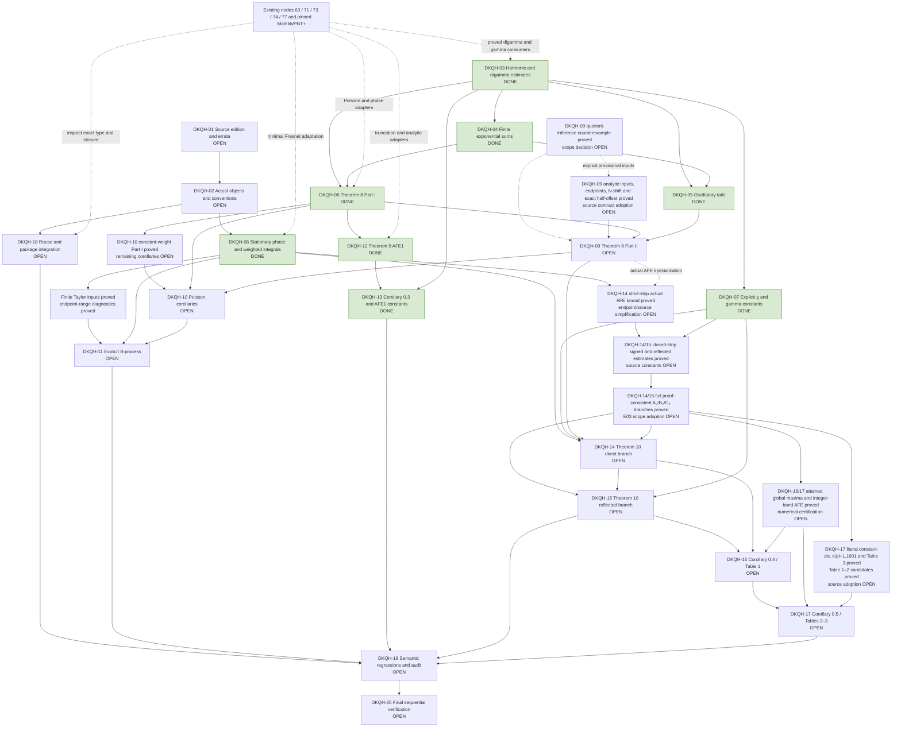

# Proof architecture

**ACTIVE GOAL — activated 5 October 2026. 8/20 proof gates complete.** DKQH-03 through DKQH-08, DKQH-12 and DKQH-13 are complete; twelve gates remain OPEN. Source review and the remaining analytic proofs are in progress.

Source review precedes a fixed Lean signature. The two Poisson estimates are substantive independent outputs; an AFE specialization alone does not close the general theorem. The reflected AFE branch must consume the actual direct-branch remainder and χ identity. Numerical certification follows the analytic assembly. Preserve the distinct scaffold, development and release statuses.

## Active source-review evidence

E01 and E02 have exact source diagnostics. E05 has a kernel-checked Part-I counterexample and an owner-accepted repair adding two monotonicity conditions. PowerWeights proves both conditions for the actual AFE weight/phase pair, including sigma=0. These source diagnostics alone were partial evidence. The subsequent complete corrected Part-I theorem closes DKQH-08; DKQH-01/02/09 remain OPEN; the later AFE1 proof closes DKQH-12.

`HarmonicDigamma` now derives the real digamma series and logarithmic bounds from pinned PNT+, proves convergence and all six nonalternating Lemma-1 estimates with the printed constants, and includes source-index reindexing bridges. Negative-shift bounds also cover N=0. AlternatingHarmonic completes both Appendix-Lemma-11 bounds with the printed constants. DKQH-03 is DONE after exact-type and dependency checks; the later Part-I and AFE1 sections record subsequent progress; Part II and AFE2 remain open.

G03 consumes the pinned digamma/Gamma libraries directly. Its source-index conventions are proved locally, so the former speculative G02 to G03 edge is removed. The unfinished zeta/chi/sign conventions in G02 do not enter these harmonic proofs. Source review is complete for Lemma 1 and Lemma 11; DKQH-01 retains the other discrepancies.

## Lemma 2 implementation checkpoint

FiniteExponentialSums now proves the actual geometric identity, both branches of the generic S₀ and tilde-S₁ bounds, the exact integer-frequency values, and the half-integer two-sided error with radius 1/y. Its finite Abel argument gives the stronger generic bound 1/|sin(πx)| and explicitly implies the printed bound. Six unfolded SemanticRegression consumers preserve the actual complex exponential, positive indices, floor, denominator and half-integer constant. DKQH-04 is DONE after the exact-source audit and sequential verifiers passed.

G04 consumes G03 to identify the alternating harmonic limit. Its Fourier and floor conventions are proved locally, independently of the unfinished zeta/chi conventions in G02. The dependency edge now records that actual proof route.

## Lemma 3 implementation checkpoint

ExponentialTails proves both actual oscillatory series absolutely convergent and establishes the generic Z₀/Z₁ bounds with the printed constants. The finite Abel bound is applied directly to the mixed reciprocal weights, avoiding separate unordered sums of conditionally convergent terms. At half-integers, exact complex-to-real adapters consume Lemma 11; differentiation of Mathlib's Gamma reflection formula and a proved monotone paired series give the explicit π/2 refinement for δ≥1/2. Seven unfolded source consumers and every public tail theorem are included in the passing focused audit (217 discovered theorems, 159 registered consumers, 16 linters, zero diagnostics). DKQH-05 is DONE after the sequential verifiers passed.

## Corrected Poisson integral inputs

NonstationaryPhase directly consumes the completed foundation's nonstationary-phase theorem. It proves the actual shifted-phase derivatives and quotient monotonicity for both frequency tails, including the propagation of the accepted frequency-one quotient condition to every ν≥1. The actual derivative of g(x)exp(2πif(x)) is proved, and the two complete differentiated-amplitude integral bounds retain (|g′(a)|+2πg(a)f′(a))/(π|ν∓f′(a)|). Continuous-derivative hypotheses imply the C¹ condition used by the existing theorem. Nonnegative/zero amplitudes are allowed. Three explicit source consumers check the derivative and both bounds. This was the nonstationary-input checkpoint; the later N=0 assembly below supersedes its remaining-obligation list.

## Corrected Part I at N = 0

AbelSawtooth proves the actual logarithmic Abel kernel, its paired Fourier expansion, uniform domination and the integral limit. PoissonFourier discharges absolute convergence of both integrated series from the accepted hypotheses and derives their explicit digamma/logarithmic bounds. EulerMaclaurin reuses pinned PNT+ and proves the integer translation needed for every real a≤b, with the literal (a,b] sum. PoissonPartI assembles the finite frequency integrations by parts and proves corrected_poisson_partI_zero, corrected_poisson_partI_zero_noninteger and corrected_poisson_partI_zero_half_integer. These preserve the actual weighted sum, Fourier main term, all N=0 logarithmic/digamma corrections, complex endpoint term and half-integer log(2) refinement. No Fourier identity, convergence result or remainder estimate is a supplied hypothesis. PartIRegularity contains only explicit differentiability, sign and monotonicity conditions, including the owner-approved repair.

The general-endpoint majorant uses the exact harmonic value at integer endpoints and the printed tilde-S₁ elsewhere; the actual complex boundary and its norm G are separate. These documented notation/domain repairs preserve the noninteger and half-integer formulas. Two unfolded source regressions and all public declarations are registered for the exhaustive audit. At the N=0 checkpoint the package had thirteen production modules and two verification modules, all imported and classified. That checkpoint left the fully shifted general-N statement and its final acceptance checks open; that historical checkpoint had 3/20 gates complete. Part II and all AFEs were still OPEN at that stage.

## Fully shifted Part I accepted implementation

PoissonShift proves the complete corrected Part I theorem for every natural N<f′(b). Its explicit hypothesis record is built from the printed strict phase monotonicity and positive weight together with the two owner-approved conditions; the core theorem also allows nonnegative weights. The proof transports every condition to f−Nx, proves equality at all integer samples (including negative integers), reindexes the actual Fourier range to N≤ν≤floor(f′(a)), and identifies δ=1−fract(f′(a)). The error uses floor(f′(a))−N consistently in both logarithmic and reciprocal terms, and its actual complex boundary uses the shifted phase. These are the fully shifted E06 corrections, not a claim that the derivative or general boundary is invariant.

Public endpoints are corrected_poisson_partI, corrected_poisson_partI_noninteger and corrected_poisson_partI_half_integer. Two unfolded general-N regressions complement the two N=0 consumers and preserve every constant and endpoint term. No result equivalent to a remainder bound is assumed. At the DKQH-08 checkpoint the inventory was 80 files, fourteen production modules and two verification modules. DKQH-08 was accepted after its exact-source review, focused audit and sequential foundation/paper BATs passed. That acceptance checkpoint had 4/20 gates complete.

## DKQH-08 completion evidence

The accepted source contract is the owner-approved Part-I monotonicity repair with the documented E01/E06 endpoint, Fourier and full phase-shift corrections. Public corrected_poisson_partI and its noninteger/half-integer specializations prove the actual weighted sum minus the actual Fourier main term for every natural N<f′(b). The regularity records contain only analytic hypotheses; partIRegularityAt_of_source_hypotheses derives the general record from the printed strict phase/positive weight assumptions plus the accepted repair. The proof permits zero/nonnegative weights without a limiting assumption. General integer endpoints use the exact harmonic finite sum, and half-integers have zero complex boundary and the printed log(2) refinement.

The four unfolded SemanticRegression.partI_zero_source, partI_zero_half_integer_source, partI_general_source and partI_general_half_integer_source consumers verify source objects, endpoints, δ, floor shifts, constants and the fully shifted G term independently of the exhaustive dependency check. The proof chain uses the existing foundation nonstationary theorem, Lemma 1/11 and Lemma 2, the new Abel integral argument, translated Euler–Maclaurin and finite integration by parts. G05’s oscillatory tail bounds are inputs to Part II, not the completed Part-I argument; the diagram removes the speculative G05→G08 edge.

Both sequential verifiers passed with zero Lean errors, warnings, tactic suggestions or linter failures. DKQH-08 is DONE and the total is 4/20. At that checkpoint DKQH-09/10/12 and all other unfinished gates remained OPEN. This is completion of the corrected Part-I contract, not the unchanged false printed theorem or the whole paper.

## Theorem 9 implementation and acceptance review

PoissonApplications derives the first Corollary-0.1 estimate from the constant weight and verifies every corrected Part-I hypothesis for the actual AFE power/logarithmic weights. ZetaTruncation consumes the existing node-71 Zeta0EqZeta and ZetaBnd_aux1b continuation/tail proofs, proves regularized Dirichlet-sum convergence, conjugates the actual wave to n^(-s), and proves the integer/natural sharp-cutoff and power-integral identities. AFEFirstKind.afe_first_kind assembles the exact m(c) bound for all 0<σ≤1, t≥t₀>0, c>1/(2π) and half-integer ct. The n=1 term is included under the documented E01 repair; ct=1/2 is explicitly covered, without importing the proof's unnecessary x>1 restriction.

The exact Gamma-derivative convention is proved by afeFirstConstant_eq_source. Three new unfolded semantic consumers cover Corollary 0.1 Part I, the complete source Theorem 9, and its smallest positive half-integer cutoff. At the DKQH-12 acceptance checkpoint there were 83 retained files, seventeen production modules and two verification modules, with all public declarations registered for the exhaustive audit. DKQH-12 is DONE after exact-source review and the sequential verifiers passed; the accepted count is 5/20. DKQH-10 remains OPEN for its other corollaries, and DKQH-13 retains real-cutoff transfer and certified decimal constants. Part II and AFE2 remain OPEN.

G12 consumes G08 and the existing node-71 zeta continuation directly. Its power, conjugation, index, endpoint and limit adapters are proved in ZetaTruncation; the uncompleted χ/AFE2 conventions in G02 are not premises. The former broad G02→G12 edge is removed. G13 retains real-cutoff transfer and decimal certification.

## Real-cutoff AFE1 analytic transfer

AFEFirstMonotonicity proves the actual factor increasing on 0<u<1, a uniform finite-difference bound from the convergent digamma series, m(c)/c decreasing for all allowed c, and m(c) increasing for c≥1 and t₀≥1. These are analytic proofs on full intervals, without sampling, optimizer output or assumed derivative inequalities.

AFEFirstRealCutoff chooses x=floor(t)+1/2, proves equality of the actual sharp sums, and derives its scale c=x/t and every admissibility condition. The two scale branches are bounded by the exact three-way maximum in eq:def-c0, yielding afe_first_kind_real_cutoff for every real t≥t₀≥14 and 0<σ≤1. The full real-Gamma source maximum is identified by afeFirstRealConstant_eq_source and tested with the source integer-floor convention in SemanticRegression.corollary_zero_three_source. At the real-cutoff analytic checkpoint there were 85 files, nineteen production modules and two verification modules. All new public declarations are registered for audit. That analytic checkpoint left DKQH-13 OPEN for its two decimal certificates; the subsequent certification section records their implementation. The later DKQH-13 acceptance receipts supersede this analytic checkpoint.

## AFE1 decimal certification and DKQH-13 acceptance review

AFEDigammaNumerics proves ψ(x)≥log(x)−1/(2x)−1/(12x²) for every x>0 by a positive logarithm series, an explicit rational remainder and a finite telescoping limit. The actual digamma recurrence and ψ(1)=−γ then bound both special-function values by 31 finite reciprocal terms and elementary logarithms. The logarithms use proved finite Taylor lower/upper bounds after argument reduction. AFEFirstConstants checks four finite rational certificates with ordinary kernel-checked norm_num; pi is rounded downward from Mathlib's proved enclosure, and each reciprocal argument is rounded upward using proved factor monotonicity.

All six branches in the exact c₀ maxima are bounded. afeFirstRealConstant_small_le proves c₀(14.13472)≤1.2552; afeFirstRealConstant_large_le proves c₀(3·10^12)≤1.2127. The public afe_first_kind_small_decimal and afe_first_kind_large_decimal consume those certificates and the actual real-cutoff AFE. Two unfolded source consumers preserve σ∈(0,1], the exact thresholds, inclusion of n=1, actual ζ and the displayed decimals. No assumption about zero verification or RH occurs. At DKQH-13 acceptance the inventory was 87 files, twenty-one production modules and two verification modules. All new public declarations and consumers are registered. DKQH-13 is DONE after the exact-source review and sequential foundation/paper checks passed; the accepted count is 6/20.

## Chi reflection and Lemma 7 implementation

ChiReflection proves the valid functional equation ζ(s)=χ(s)ζ(1−s), χ(s)χ(1−s)=1 for every nonreal s, conjugation of the literal chi product and sharp sums, the exact reflected remainder with exchanged x/y, and equality of remainder norms at both height signs. It directly consumes the existing node-71 zeta conjugation theorem and covers the σ=1/dual σ=0 identity without a strict-strip restriction. It also proves |χ|=1 on the critical line. These are algebraic/branch bridges; the AFE2 analytic bound is still open.

ChiGammaFactor proves the principal negative-imaginary power, the exact identity Γ(1−s)(2π/i)^(s−1)(1−exp(iπs))=χ(s), and the actual relative error exp(iπs)/(1−exp(iπs)). A uniform denominator bound gives the printed Lemma-7 estimate for |Im s|≥t₀>0, including negative heights. The printed e^(−πt) is large but valid when t<0; it is not silently replaced by e^(−π|t|) with the same branch. The conjugated theorem uses 2π/(−i) and proves the decaying e^(−π|t|) bound at negative heights. Five unfolded regressions cover the corrected functional equation, literal remainder reflection/conjugation, printed Lemma 7 and conjugate branch.

At the reflection/Lemma-7 checkpoint the inventory was 89 retained files, twenty-three production modules and two verification modules. All new public theorems and consumers are registered. At that checkpoint DKQH-07 remained OPEN for Lemma 6 and the accepted count was 6/20; the later Lemma-6 acceptance closes it. DKQH-15 remains OPEN for the actual reflected AFE bound. The subsequent reflection/digamma sequential checkpoint verifies this scope; the earlier focused audit recorded 591 exhaustive theorem dependencies and 367 registered consumers with zero diagnostics.

## Explicit digamma input for Lemma 6

GammaDigammaReal proves |Re ψ(x+it)−log t|≤1/(2t) for every t>0 and 0≤x≤1/2, including x=0. The proof consumes the actual complex digamma series, specializes the existing Euler–Maclaurin theorem, and computes the full variation of the real reciprocal u/(u²+t²) on either side of its critical point u=t. Finite endpoint terms are retained before taking the limit. This is a uniform analytic inequality, without a grid or an assumed Gamma estimate. It supplies the full χ bound with C₀–C₃ in the subsequent accepted DKQH-07 chain.

The preceding digamma checkpoint had 90 retained files, twenty-four production modules and two verification modules. All new public theorems are registered; the focused audit passed with 624 exhaustive theorem dependencies, 396 registered consumers and zero diagnostics. The accepted count remains 6/20.

## DKQH-07 acceptance: full Lemmas 6–7 — 5 October 2026

GammaHorizontal proves the logarithmic Gamma derivative and explicit horizontal comparison on the closed real-part interval [0,1/2], including zero. GammaAnchors derives the exact norms at 0+it and 1/2+it from Gamma reflection, recurrence and conjugation. GammaStrip combines them with the proved digamma inequality to bound the actual Gamma modulus using the distance to the nearer endpoint.

ChiConstants defines the literal printed C₀–C₃, proves the exact factorization C₀=C₂(1+exp(−πt₀))(1+C₁/t₀), and proves uniform absorption of both exponential corrections. ChiBound.norm_chi_le_chiC0 concludes the source inequality for every 1/2≤σ≤1 and |t|≥t₀≥1/π. Its proof consumes the actual Gamma product and principal-power identity, preserves the height scale, and transfers negative heights by proved conjugation. SemanticRegression.lemma_six_source unfolds the chi product and all four printed formulas. No numerical sample, Stirling remainder assumption or additional source hypothesis is used.

The current inventory is 95 retained files, twenty-nine production modules and two verification modules. Every new production module is classified and root-imported; all public theorems are registered. DKQH-07 is DONE after exact-source review, exhaustive audit and sequential foundation/paper verification. The accepted total is 7/20. The Reproduction Manifest records both log paths and hashes. Part II, stationary phase and the AFE2 estimates remain open.

## Weighted-integral development after DKQH-07 acceptance

FirstDerivativeTest proves source Lemma 4 with constant 2, both monotonicity directions and the supremum over the actual interval. The decreasing case directly consumes the existing node-71 theorem through NonstationaryPhase; reflection proves the increasing case. The maximum is proved to occur at an endpoint. WeightedIntegralSums proves the exact finite quadratic/reciprocal bound with its 1/(8y²) correction and the weighted alternating boundary estimate. These have exact-source consumers and registered public declarations.

WeightedIntegrals defines the actual finite J(a,b,m), proves local integrability for Re(s)<1 and performs both integrations by parts including the zero endpoint. LowerIntegralEstimate sums these identities before taking norms and proves the complete first inequality of Lemma 5, preserving both height signs, the physical scale, both half-integer cutoffs and every printed constant. UpperIntegralEstimate proves conditional improper convergence and the complete second inequality of Lemma 5, with constant 2/π and log(y)+1. DKQH-06 is DONE after the stationary-point and phase proofs and their sequential verification. The current inventory is 142 retained files, seventy-six production modules and two verification modules; the accepted count is 8/20. The last full sequential receipts cover the preceding 119-file finite-inequality checkpoint; the Reproduction Manifest records exact scope, paths and hashes.

WeightedIntegralPhase discharges the actual power/logarithmic-phase quotient monotonicity for both height signs, applies Lemma 4 on positive truncated intervals, and passes to zero by proved continuity of the integrable primitive. Its source-scale consumer bounds the literal integral of u^(2−s) exp(2πimu) by x^(2−σ)/(π(y−m)), deriving the cutoff condition from 2πxy=|t|. The complete first Lemma-5 sum is now proved in LowerIntegralEstimate and consumed literally by lemma_five_lower_sum_source. The complete upper-tail bound and convergence are now proved in UpperIntegralEstimate and checked by lemma_five_upper_sum_source.

Lemma 5 upper-tail source correspondence: J(N,∞,m) is defined as the limit of the actual finite interval integrals, and convergence is proved for 0<σ<1 and m>0. The source consumer states existence and the literal integral limit explicitly. The printed condition involving the bound index m is read as N>t/(πm) for every positive mode included in the sum; the convenient stronger uniform cutoff N>t/π is proved separately. N>0 is explicit, as required by the positive integration domain. The printed decreasing-quotient assertion need not hold for negative t; the proof instead bounds the actual unit-amplitude primitive for both signs and transfers that bound to u^(−σ) by integration by parts. No additional monotonicity assumption or change in the claimed inequality is used. The half-integer and physical-scale assumptions are unnecessary for this second bound. The finite first bound preserves them and every printed coefficient.

The minimal node-63 Fresnel adaptation now proves the actual symmetric quadratic-integral limit, its principal branch exp(−πi/4), and the quantitative finite-window error. StationaryPoints derives the unique point in the actual decreasing derivative range, proves the shifted phase derivative vanishes, identifies the logarithmic J-phase critical point and its height-sign restriction, and consumes the Fresnel limit to obtain exp(2πi(f(xν)−νxν−1/8))/sqrt(|f″(xν)|). Three independent source consumers check point selection, the finite-window estimate and the phase/amplitude limit. These complete DKQH-06 after the exact-source checks, exhaustive audit and sequential foundation/paper verification. DKQH-11 still requires the nonlinear replacement estimate and all printed B-process error constants. Attribution and exact source hashes are in Dependencies and local_reuse_inventory.json.

## Actual AFE integral assembly — 5 October 2026

DampedWeightedKernel directly consumes the pinned foundation's DFIComplexLaplace theorem for the actual exponentially damped kernel. Dominated convergence removes damping on finite intervals; integration by parts against the proved oscillatory primitive gives a damping-uniform tail bound. These prove the actual conditionally convergent J(0,∞,m) equals (−2πim)^(s−1)Γ(1−s), with the principal branch explicitly normalized to Γ(1−s)(2π/i)^(s−1)m^(s−1). Lemma 7 then supplies the actual χ factor and its signed-height relative error. No convergence or Gamma evaluation is an assumed theorem parameter.

WeightedIntegralAssembly sums the actual positive integer frequencies and isolates m=1 to prove the dual polynomial bound y^σ log(y)+1, including σ=0 in that finite bound. Its public norm_sum_weightedIntegral_sub_chi_le combines the exact main integral with both complete Lemma-5 estimates. SemanticRegression.weighted_integral_gamma_source, weighted_integral_chi_source and afe_integral_sum_source retain literal integrals, the physical relation 2πxy=|t|, half-integer cutoffs, principal powers, and every constant. The assembled integral estimate is proved for 0<σ<1; individual zero-endpoint/improper integrals are not asserted to converge at both strip endpoints.

This completes the integral stage of equation (4.59), not Theorem 10. DKQH-14 and DKQH-15 remain OPEN for the Poisson-to-zeta assembly, endpoint continuation, accepted error formulas and direct/reflected bounds. DKQH-09 still has the separate positive-frequency monotonicity gap; the Part-II E₁ sign correction remains an owner-decision proposal. No additional gate is accepted: 8/20 are DONE. The current inventory has 142 retained files, 76 production modules and two verification modules; all are classified and root-imported. The Reproduction Manifest distinguishes focused and sequential evidence.

## AFE second-derivative conditions and B-process decimal

AFESecondWeights proves the actual second derivatives of u^(−σ) and (t/(2π))log(u), and the derivative of their weight/phase-derivative product. It proves the printed decreasing conditions and strict positivity when σ,t>0. For every positive frequency, all four positive-frequency quotients normalize to a nonnegative constant times u^(−σ)/(νu+t/(2π))^k, k=2 or 3, and are proved nonincreasing on u>0. These proofs include σ=0. The actual functions and physical t/(2π) scale are unfolded in two semantic consumers. This resolves those application-specific conditions; the general Part-II inference remains unproved and no new general hypotheses have been adopted.

StationaryConstants proves (2/π)(γ+2log(2))≤1.251 from the existing finite Euler-constant/logarithm bounds and a rational pi enclosure. Its source consumer proves the literal −(2/π)Re ψ(1/2) bound. This certifies the numerical component in the B-process; the nonlinear stationary-phase replacement, endpoint modes and the complete 2.686/error estimate remain OPEN under DKQH-11. No new gate is accepted; 8/20 are DONE.

The preceding derivative/decimal scope has 112 retained files and 46 production modules, with two explicit verification modules. All production modules are classified and root-imported, and every new public theorem is registered. The latest full sequential receipts cover the preceding 119-file finite-inequality stage; current-scope verification is recorded separately in the Reproduction Manifest.

## Second oscillatory integration: actual source inputs

OscillatoryParts proves integration by parts for the actual weighted exponential, retaining the complex endpoint factor 1/(2πi). Its general technical estimate explicitly assumes the two amplitude/derivative quotients are nonincreasing and derives the remainder by the proved first-derivative test. The negative-frequency specialization derives both quotient conditions from decreasing |h|, |h′|, |f″| and f′ above the frequency cutoff. AFESecondModes applies the positive-frequency estimate to each actual amplitude h=g′ and h=gf′, using AFESecondWeights to discharge all regularity and quotient conditions, including σ=0. The source consumers retain the actual integrals, complex boundaries, squared/cubed denominators, physical t/(2π) scale and constants 1/(2π²).

These are proved integral estimates, not the complete weighted Poisson Part II formula. The infinite coefficient summation, full H/H₁/B/E assembly, general-N transfer and remaining source decisions stay OPEN under DKQH-09. The Part-II E₁ sign correction remains pending owner approval, and no new general Part-II hypotheses have been adopted. Current scope: 142 retained files, 76 production modules and both verification modules; 8/20 gates remain complete. Exact current-scope evidence is recorded in the Reproduction Manifest.

## Part-II positive-frequency inference: concrete diagnostic

PartIIMonotonicity proves a smooth polynomial example on [0,1]: f(u)=2u−u²/20+u³/300 and g(u)=10−u+u²/20−u³/6000. The printed positive/decreasing conditions hold strictly, and the already accepted Part-I conditions also hold. Nevertheless |g″|/(1+f′)² increases between the endpoints: its values are 1/90 and 110/9409. The complete hypothesis conjunction and failed quotient inference are kernel-checked; SemanticRegression unfolds both polynomials. This refutes the intermediate monotonicity assertion preceding bnd-int-plus-h1, not the full Part-II inequality.

A concrete candidate repair is to require, for h=g′ and h=g(f′−N), both |h′|/(ν+f′−N)² and |h f″|/(ν+f′−N)³ to be nonincreasing for every positive integer ν. These are four analytic input conditions, not the Poisson conclusion. AFESecondWeights already proves them for the actual N=0 AFE weights and phase, including σ=0; OscillatoryParts and AFESecondModes consume them in the second-integration estimate. No additional general Part-II hypotheses have been adopted. The scope decision and the separate E₁ sign decision remain distinct. DKQH-01 and DKQH-09 remain OPEN; total 8/20 DONE.

## Positive-frequency second-integration series

SecondModeTails proves absolute convergence of the actual series of integrals divided by 2πν, identifies its complex endpoint sums with positiveTail, and bounds the remaining square/cube series using the complete Lemma-1 coefficients. The endpoint cancellations are retained before taking norms. The generic theorem exposes the required analytic quotient conditions. AFESecondModes.afe_positive_second_tail_bound discharges all of them for h=g′ and h=gf′ with g(u)=u^(−σ), f(u)=(t/(2π))log(u), t>0 and σ≥0. The new semantic consumer states the literal integral series at that physical scale, including σ=0. This is the positive-frequency series component; the upper-frequency series, H/H₁ assembly, general-N transfer, E₁ decision and general Part-II scope decision remain open under DKQH-09. The accepted count remains 8/20.

## Upper-frequency series and actual Poisson coefficient assembly

UpperModeTails proves absolute convergence, exact oscillatory endpoint sums and both complete square/cube harmonic bounds for all frequencies above M. AFESecondWeights proves decreasing absolute amplitudes and their derivatives for both actual AFE choices, including σ=0. AFESecondModes.afe_upper_second_tail_bound discharges every analytic condition; its source consumer fixes M=floor(t/(2πa)) and derives the strict cutoff inequality.

SecondCoefficients proves the actual derivative integral splits into the g′ and gf′ integrals, tracks the factors 1/i and 2π in each Fourier coefficient, and sums those identities using proved convergence. Its afe_second_poisson_identity applies the existing exact finite Poisson identity to the actual AFE functions and derives all four series-convergence inputs from the new tail estimates. The physical-scale source consumer uses the actual logarithmic phase, power weight and floor cutoff. These close the series-to-Poisson identity bridge. The H/H₁/B/E inequality assembly, general-N transfer and unresolved source decisions remain OPEN under DKQH-09; AFE2 and the B-process remain incomplete. Current inventory: 142 retained files, 76 production and two verification modules, 129 semantic consumers; accepted count 8/20.

## Actual second-order finite AFE Poisson inequality

SecondCoeffBounds combines the two real-amplitude estimates into the literal H and H₁ numerators, deriving the product-derivative bound and proving the scalar coefficients nonnegative from their actual harmonic series. The generic coefficient-combination helpers expose their narrower amplitude-bound inputs; afe_positiveCoefficient_bound and afe_negativeCoefficient_bound discharge them from the proved AFE series estimates. The public afe_finite_poisson_second_bound then consumes the existing exact finite Poisson identity to bound the actual weighted integer sum minus the actual Fourier-integral sum, with both endpoints, the complex boundary norm, and both square/cube coefficient contributions present. Its source consumer states the literal finite sum and Fourier integrals at t/(2π), including σ=0.

The actual AFE inequality keeps the positive and negative square coefficients separate. Their exact equality to the proposed E₁ envelope divided by y is proved as a diagnostic, without adopting the pending repair. The cube coefficients assemble exactly to the unchanged printed E₂; a literal source consumer proves its bound on both actual cube tails. General Part-II scope, the E₁ decision, the Z₀/Z₁ endpoint simplification and shifted-N source contract remain open under DKQH-09. The AFE2 zeta-limit, direct/reflected bounds and numerical obligations remain open. The accepted count stays 8/20; current scope is 142 retained files, 76 production and two verification modules, 129 semantic consumers.

## Half-integer endpoints and uniform tails

SecondEndpoints proves conjugation of the actual positive tail, its norm symmetry, and the complete half-integer B bound with π/2, log(2), the first omitted-frequency correction and the 3/2 correction. It applies this bound and the existing exact half-integer boundary identities to the actual AFE finite Poisson inequality. All endpoint, cutoff and nonnegativity conditions are derived from the stated hypotheses; the two square coefficients remain separate pending the E₁ decision. The source consumer states the literal finite sum and Fourier integrals at t/(2π), including σ=0.

The actual tails also have uniform bounds 2 for the positive tail and 4 for the negative tail when 0<y≤1/2, at every real endpoint including integers. These are limiting-argument inputs, not new source constants. The general-N Part-II contract, source decisions and actual zeta-limit remain open. Current scope: 142 retained files, 76 production and two verification modules, 129 semantic consumers; accepted count 8/20.

## Actual strict-strip AFE assembly

AFESecondLimits proves the upper-endpoint contribution tends to zero, conjugates the actual finite Poisson formula, and consumes the existing zeta truncation and convergent weighted-integral tails. The resulting afe_zeta_sub_sum_pole_integrals_bound has the actual ζ value, sharp polynomial, pole term and positive-frequency improper integrals. afe_strict_strip_bound then applies the proved Gamma/χ and lower-integral estimates to obtain the actual two-polynomial AFE for 0<σ<1 and positive t, with half-integer x,y≥1 and 2πxy=t. Every error term is retained explicitly; no remainder estimate or convergence certificate is an input.

The separate positive and negative square coefficients remain visible, so this theorem does not adopt the pending Part-II E₁ correction. DKQH-14/15 remain OPEN for closed-strip endpoints, accepted source error formulas, both height signs and the reflected quantitative branch. General Part-II scope and numerical obligations also remain OPEN. Earlier checkpoint descriptions of the missing Poisson-to-zeta assembly are superseded by this proof. Current scope: 142 retained files, 76 production and two verification modules, 129 semantic consumers; accepted count 8/20. The Reproduction Manifest records verification scope separately from source completion.

## Closed-strip AFE and reflected quantitative estimate

AFESecondClosed extends the assembled estimate continuously to 0≤σ≤1. It proves continuity of the actual sharp polynomials, χ and nonreal ζ remainder, substitutes the exact H/H₁ formulas, and applies the strict-strip theorem on the closure. No convergence of the individual zero-endpoint improper integrals is assumed at σ=0 or σ=1. Conjugation gives afe_closed_strip_abs_bound with positive |t| throughout the error. afe_closed_strip_reflected_bound consumes the actual functional equation and the direct bound at 1−σ with exchanged cutoffs; afe_closed_strip_min_bound proves both estimates simultaneously.

The E07 dual-endpoint proof obligation is therefore resolved for this explicit assembled bound. E04's height-sign bridge is also quantitative. Theorem 10's stated constants, parameter-uniform A₀/B₀ simplifications and equation-(5.2) branch decision remain separate obligations under DKQH-14/15; these gates remain OPEN. No pending general Part-II correction is adopted. Earlier checkpoint lists of missing endpoint/reflection assembly are superseded by this proof. Current scope: 142 retained files, 76 production and two verification modules, 129 semantic consumers; accepted count 8/20. Verification receipts are recorded in the Reproduction Manifest.

## Cancellation and half-integer coefficient simplification

SecondTailSharp retains the subtraction between two nonnegative paired reciprocal sums. It proves the actual negative tail is at most π/(2y), and the positive tail at most log(2)/y, at half-integer endpoints with δ≥1/2. Their sum is bounded by (π/2+log(2))/y. AFESecondLimits now consumes this stronger endpoint theorem, and AFESecondClosed carries the improved error through the same endpoint-continuity and reflection proofs. The older literal Corollary-8.1 endpoint bound remains preserved in SecondEndpoints.

SecondHalfErrors adds the positive and negative square/cube majorants exactly at half-integer y, retaining their correct signs. Analytic logarithmic and rational inequalities prove their bounds 46/(9y) and 230/(27y) on the source AFE domain. Unfolded consumers apply these to the actual infinite square/cube series. No numerical optimization, source-E₁ adoption or general Part-II hypothesis change is involved. The source-constant A₀/B₀ assembly and all remaining gate obligations remain OPEN. Current scope: 142 retained files, 76 production and two verification modules, 129 semantic consumers; accepted count 8/20.

## Literal A/B formulas assembled for the actual AFE

AFESecondBounds proves afe_second_source_AB and afe_second_source_AB_reflected for the actual ζ remainder and both sharp Dirichlet polynomials, including σ=0, σ=1 and both height signs. The A expression contains every term of def:A(s,t,x,y); B is exactly def:B(s,t,x,y), evaluated at positive |t|. The stronger endpoint cancellation and the proved 46/9 and 230/27 bounds imply this source A expression, with an explicit nonnegative difference. The Gamma error factors exactly into B·y^(σ−1). Reflection cancels the reciprocal χ factors and yields log(x) with exchanged cutoffs and the dual exponent.

Two literal source consumers unfold both polynomials and every A/B coefficient. Uniform A₀/B₀ estimates, the equation-(5.2) branch resolution and certified table bounds remain OPEN under DKQH-14–17. This progress does not adopt the pending general Part-II repairs or close a gate. Current scope: 142 retained files, 76 production and two verification modules, 129 semantic consumers; accepted count 8/20.

## Theorem-10 proof-consistent branches proved; E03 adoption pending

AFESecondUniform proves afe_second_uniform_direct, afe_second_uniform_reflected and their piecewise assembly afe_second_uniform_branches. They concern the actual ζ remainder and both sharp polynomials, with 1/2≤σ≤1, |t|≥t₀≥2π, half-integer x,y≥h≥3/2, and 2πxy=|t|. Every term of A₀, B₀ and the already proved C₀ is retained. The larger cutoff is proved to exceed x₀=max(h,sqrt(t₀/(2π))); the complete B numerator is proved decreasing analytically on the entire normalized interval z≥1. Source consumers unfold both polynomials and every A₀/B₀ term. The proofs include the diagonal, σ=1/dual σ=0, both height signs and exact logarithmic coefficients.

The proved assignment is E_direct=A₀(σ,h,t₀)+C₀(σ,t₀)B₀(σ,t₀) for x≥y and E_reflect=A₀(1−σ,h,t₀)C₀(σ,t₀)+B₀(1−σ,t₀) for x<y. This agrees with the derivation and ancillary call sites; the printed equation (5.2) reverses these E₀ assignments. The frozen printed version is preserved. Adopting the proof-consistent quantitative contract requires the explicit E03 scope decision before DKQH-14/15 can be marked DONE; neither the earlier Part-I approval nor the separate pending Part-II proposals supplies that decision. The existing whole-paper count remains 8/20. Current scope: 142 retained files, 76 production and two verification modules, 129 semantic consumers. Reproduction evidence distinguishes this implementation from source-contract acceptance.

## General second-order analytic interface and constant-weight Part I

PoissonCorollary proves Corollary 0.1 Part I with the actual unweighted sum, literal Fourier integrals, and every printed logarithmic/digamma constant. The constant weight discharges both accepted Part-I repair hypotheses, and the more general theorem retains every allowed lower frequency N.

PartIIInputs proves convergence, both coefficient estimates, and the complete finite second-order Poisson inequality for general f and g from an explicit provisional SecondOrderRegularity interface. Its inputs are closed-interval differentiability/continuity, decreasing absolute derivatives, and the two positive-frequency quotient conditions for each actual amplitude g′ and gf′. None is a remainder bound or conclusion-equivalent certificate. The actual AFE logarithmic phase and power weight satisfy every field, including sigma=0, and a separate consumer applies the general inequality to them. The two square coefficients remain separate, while the actual H/H₁ and boundary terms are retained.

This technical conditional theorem does not adopt a revised general source contract. The Part-II quotient and E₁ proposals and the Theorem-10 E03 decision remain pending. General-N Part-II transport, explicit endpoint-majorant packaging, Part-II corollaries and the B-process remain under DKQH-09–11. DKQH-10 is still OPEN because Part I alone does not complete all its corollaries. The accepted count remains 8/20. Current scope: 142 retained files, 76 production and two verification modules, 129 semantic consumers. Verification evidence and exact scope are recorded separately in the Reproduction Manifest.

## General second-order endpoint and frequency transport

PartIIBounds proves the complete explicit Poisson inequality from the provisional SecondOrderRegularity inputs at every real endpoint. Away from integers its endpoint factor is the literal Z₀+Z₁. At integer endpoints, where the printed sine denominator is undefined, the finite harmonic convention and exact absolute reciprocal-tail digamma bound give a proved extension. The actual complex G boundary is retained. A separate identity packages the two square coefficients into the proposed E₁ and the unchanged E₂ without adopting the pending quantitative repair.

The actual weighted integer sum and Fourier main sum transport to every allowed N through f(u)−Nu. The shifted half-integer theorem retains M=floor(f′(a))−N, y=f′(a)−N, the invariant δ=1−fract(f′(a)), every H/H₁ term and the literal half-integer B majorant for δ≥1/2. Exact consumers expose both sums. These close the analytic endpoint and general-N transport obligations for this provisional interface. Mapping and adopting the corrected source hypotheses, the pending E₁ decision, and the remaining Part-II corollary/B-process obligations still keep DKQH-09–11 OPEN. The accepted count remains 8/20. Current scope: 142 retained files, 76 production and two verification modules, 129 semantic consumers.

## Constant-weight second order and exact AFE maxima

PartIIConstant discharges every constant-weight field from explicit phase regularity and two positive-frequency quotient conditions. Its full unweighted half-integer estimate retains both square/cube coefficients and both endpoint B terms. The proved finite-head term is (log(2)+1/f′(a))/π. The printed Corollary 0.1 Part II writes half that term and references the δ=1/2 B formula without that restriction. These are unresolved source-correspondence issues, not silently accepted changes; the present specialization requires δ≥1/2 and keeps its proved coefficient. No counterexample to that entire printed corollary is claimed here.

AFEUniformMax proves continuity of every A₀/B₀/C₀ term, existence and attainment of the exact direct/reflected maxima on the whole closed interval [1/2,1], and nonnegativity of δ₀=max(C₀)−1. The actual two-polynomial AFE consumes these maxima in both Corollary-0.4 logarithmic branches. The exact hₖ=floor(exp(k−1))+1/2 band endpoints satisfy hₖ≥3/2, and both Corollary-0.5 band estimates follow for every integer k≥1, in particular k=1,...,50. The proof covers both height signs and sigma endpoints. No numerical maximum, decimal table value or optimization output is an assumption.

The global analytic maxima and band deductions are proved for the proof-consistent Theorem-10 assignment, whose E03 adoption remains pending. Table certification, accepted decimal rounding, the k/π+1.1601 bound and constant-6 consequence are still OPEN under DKQH-16/17. Earlier descriptions of global maximum existence and band transfer as missing are superseded by these proofs. DKQH-09–11 also remain OPEN for their stated source and stationary-phase obligations. Current scope: 142 retained files, 76 production and two verification modules, 129 semantic consumers; accepted count 8/20.

## Literal constant-six consequence proved

AFECoarseConstants proves afe_constant_six_direct, afe_constant_six_reflected and the piecewise afe_constant_six. These are the actual two-polynomial remainder with the unchanged constant 6, 1/2≤sigma≤1, |t|≥2π, half-integer x,y≥1, 2πxy=|t|, and min(x,y)≤10^6. Both height signs, the diagonal and sigma=1 are covered. Two source consumers unfold both polynomials.

The proof derives C₀≤1+1/t₀ and B₀≤1/t₀², proves rational bounds on every A₀ term, and splits the smaller cutoff at 100. The physical product scale proves |t|≥60000 on the larger-cutoff interval, where A₀≤5/4. Finite exponential series certify log(2)≤7/10 and log(10)≤7/3. Thus no table decimal, numerical optimizer or assumed error bound enters this consequence. This closes the constant-six sub-obligation of DKQH-17; the table cells and k/π+1.1601 certification remain open. No pending source decision is silently adopted. Current scope: 142 retained files, 76 production and two verification modules, 129 semantic consumers; accepted count 8/20.

## The unchanged large-k decimal bound certified

AFEBandConstants proves afe_band_coefficients_large_k: both exact source epsilon-k expressions are at most k/π+1.1601 for every integer 11≤k≤50 at t₀=10^10. The actual direct and reflected AFE consumers, afe_large_k_direct and afe_large_k_reflected, apply that certificate to the full sharp polynomials, including both height signs and sigma endpoints.

Finite rational logarithm/Euler bounds prove log(2)≤0.693148 and gamma≤0.577216; a finite exponential sum proves exp(10)≥22000. The physical x₀ exceeds 39890 at the exact threshold, independently of h. Every A₀ term is bounded on the complete sigma interval, giving A₀≤1.160097. The proved bounds C₀≤1+1/t₀ and B₀≤1/t₀² control both attained maxima and the k-delta correction with a rigorous margin below 1.1601. No floating-point value or optimizer result is used as evidence.

The large-k and constant-six sub-obligations are now proved. Table 1–3 cells and outward rounding/source adoption still keep DKQH-16/17 OPEN; the pending E03 decision and general Part-II decisions remain separate. Current scope: 142 retained files, 76 production and two verification modules, 129 semantic consumers; accepted count 8/20. The Reproduction Manifest distinguishes the preceding full sequential scope from this expanded verification.

## Table 3 certified on every displayed range

AFETableThree proves both exact analytic epsilon coefficients lie below the eight unchanged source bounds, for every integer 11≤k≤50 and the entire closed sigma strip. Finite rational logarithm and Euler-constant enclosures, finite exponential series, global maximum bounds and exact rational arithmetic certify the group endpoints. The previously proved k/π+1.1601 bound covers each interior integer. The actual direct and reflected zeta remainders consume these certificates, with both height signs and the full half-integer cutoff conditions. No numerical samples or assumed decimal inequalities enter the proofs.

Table 3, the large-k bound and the constant-six consequence are now proved. Table 1–2 certification and accepted rounding corrections still keep DKQH-16/17 OPEN; E03 and general Part-II decisions remain pending. Current scope: 142 retained files, 76 production and two verification modules, 129 semantic consumers; accepted count 8/20. Verification receipts are recorded separately in the Reproduction Manifest.

## Table 1 failures and proposed Table 2 certificates

TableLowerBounds proves a fourth-order upper estimate for the actual digamma function and a finite lower enclosure 0.577215664≤γ. Combined with rational logarithm/pi bounds, it proves that Table 1's direct entries 2.265204 at exact 2π, 1.792736 at 1000, and 1.750701 at 10¹⁰ are strictly below the actual direct maxima: sigma=1 supplies each witness. These are failures of the claimed numerical maximum bounds, not counterexamples to the zeta remainder inequality itself. The printed entries remain preserved.

AFETableTwo proves outward candidate bounds for all twenty cells at k=1,...,10, over the complete closed sigma strip. Finite exponential sums certify the floor-defined lower cutoffs. Distinct sigma ranges for the two A₀ inputs give separate direct/reflected rational certificates, propagated through the actual global maxima and then the actual two-polynomial AFE. The proposed decimals are listed in Computation Review and explicitly named proposedTableTwoDirect/proposedTableTwoReflected; they are not yet an adopted source repair.

The unchanged Table 3, large-k bound and constant-six consequence remain proved. DKQH-16/17 stay OPEN for the remaining Table 1 certificates and explicit adoption of numerical repairs. General Part-II and E03 decisions remain pending. Current scope: 142 retained files, 76 production and two verification modules, 129 semantic consumers; accepted count 8/20.

## Global chi-factor table certificates

ChiTableBounds bounds the actual C₁ on the entire closed sigma strip by a concave cubic and an explicit sum-of-squares identity. A finite Taylor remainder certifies C₂; finite positive exponential sums bound the remaining tails. The complete C₀ product and its actual attained maximum therefore give δ₀≤0.05961930 at exact 2π, δ₀≤0.0003692901 at 1000, δ₀≤3.692588·10⁻¹¹ at 10¹⁰, and δ₀≤1.230863·10⁻¹³ at 3·10¹². The last two are unchanged printed values; the first two are proposed outward replacements, not yet adopted. No optimizer output or sampled interval enters these proofs.

The remaining Table 1 epsilon assembly and numerical-repair adoption stay OPEN under DKQH-16. Table 2 candidates, unchanged Table 3, large-k and constant-six bounds are proved as described above. Pending Part-II and E03 decisions are unchanged. Current scope: 142 retained files, 76 production and two verification modules, 129 semantic consumers; accepted count 8/20.

## Complete proposed Table 1 AFE certificates

AFETableOne proves all sixteen proposed Table 1 cells over the entire closed sigma strip. The four thresholds retain exact 2π in the first row. The symmetric lower cutoffs are proved equal to floor(sqrt(t₀/(2π)))+1/2 and are derived from the physical height, half-integer condition and x=y; no extra symmetric-cutoff hypothesis remains. Separate actual direct, reflected and symmetric zeta-remainder theorems consume all coefficient certificates, preserve logarithmic factors and cover both signs of t.

The complete proposed Table 1 and Table 2 replacements are listed beside the preserved printed values in Computation Review. All unchanged Table 3 entries, k/π+1.1601 and the constant-six consequence are also proved. Numerical source-repair adoption and E03 remain pending before DKQH-16/17 can be accepted. The general Part-II decisions and DKQH-09–11 obligations remain separate. Current scope: 142 retained files, 76 production and two verification modules, 129 semantic consumers; accepted count 8/20.

## Explicit shifted Part II inputs and the exact half-offset case

PartIIShiftInputs derives the shifted second derivative at closed-interval endpoints from local nonvanishing of f′, rather than assuming a derivative identity outside the interval. It constructs the provisional SecondOrderRegularity interface from explicit twice-differentiable inputs and the pending positive-frequency quotient hypotheses. The shifted product-amplitude monotonicity follows from the existing Part I repair, nonincreasing |f″| and the derivative signs. Its consumers prove the actual full weighted Poisson inequality for every permitted N, at general endpoints and half-integer endpoints.

PartIIHalfSource derives literal square/cube and B expressions when δ=1/2 for every positive y=f′(a)−N, including y=1/2 and M=0. The full weighted-sum bound, its frequency transport and its explicit-analytic-input consumer retain the actual exponential sum and Fourier main sum. The E₁ expression is the proposed sign correction; E₂ is unchanged. This adds proof coverage without adopting the pending quotient or E₁ repairs. Mapping the final accepted source regularity, the remaining Corollary 0.1 discrepancy and the nonlinear B-process still keep DKQH-09–11 OPEN. Earlier descriptions of the shift-input and exact-half-offset bridges as missing are superseded. Current scope: 142 retained files, 76 production and two verification modules, 129 semantic consumers; accepted count 8/20.

## Stationary Taylor proof and B-process source review

StationaryTaylor proves the cubic phase remainder D|x|³/6, its derivative remainder D|x|²/2, the exponential perturbation bound πD|x|³/3 and the exact factorization of the actual shifted phase. These require existence of the first three ordinary derivatives on the genuine segment, with the third derivative bounded by D; continuity of the third derivative and infinite smoothness are not assumed. The finite Taylor proof builds the required lower-order smoothness and identifies the within-interval derivatives before applying Mathlib's Lagrange remainder. This is an input to nonlinear stationary phase, not its completed integral estimate.

BProcessReview checks the smooth quadratic f(u)=651u/200−151u²/200 on [1/2,3/2]. Its derivative runs strictly down from β=5/2 to α=99/100, with constant curvature −151/100 and zero third derivative. On the paper's interior range 1≤ν≤floor(β)−1, the reciprocal endpoint majorant in the cited stationary-phase deduction equals 302/(3π), which is strictly greater than 1.251+(2/π)log(β−α). Patel–Yang's cited argument instead restricts frequencies to α+1/2<ν<β−1/2; the paper's range does not preserve that separation. This is a proved failure of the reciprocal-majorant deduction, not a counterexample to the actual complex S₃ remainder or the full B-process inequality.

The review also proves that deleting the last stationary frequency changes the main sum by a term of exact norm 1/sqrt(|f″(x_M)|). The paper's proof uses frequencies 1 through M−1 whereas its conclusion uses 1 through M; a complete argument must account for that term or prove a different joint endpoint estimate. Neither diagnostic licenses an unapproved change to 2.686 or to the source conclusion. DKQH-11 remains OPEN for the nonlinear integral, boundary-frequency accounting and exact constant. Current scope: 142 retained files, 76 production and two verification modules, 129 semantic consumers; accepted count 8/20.
