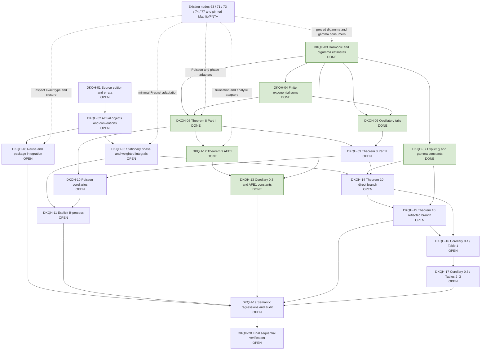

# Proof architecture

**ACTIVE GOAL — activated 5 October 2026. 7/20 proof gates complete.** DKQH-03 through DKQH-05, DKQH-07, DKQH-08, DKQH-12 and DKQH-13 are complete; thirteen gates remain OPEN. Source review and the remaining analytic proofs are in progress.

Source review precedes a fixed Lean signature. The two Poisson estimates are substantive independent outputs; an AFE specialization alone does not close the general theorem. The reflected AFE branch must consume the actual direct-branch remainder and χ identity. Numerical certification follows the analytic assembly. Preserve the distinct scaffold, development and release statuses.

## Active source-review evidence

E01 and E02 have exact source diagnostics. E05 has a kernel-checked Part-I counterexample and an owner-accepted repair adding two monotonicity conditions. PowerWeights proves both conditions for the actual AFE weight/phase pair, including sigma=0. These source diagnostics alone were partial evidence. The subsequent complete corrected Part-I theorem closes DKQH-08; DKQH-01/02/09 remain OPEN; the later AFE1 proof closes DKQH-12.

`HarmonicDigamma` now derives the real digamma series and logarithmic bounds from pinned PNT+, proves convergence and all six nonalternating Lemma-1 estimates with the printed constants, and includes source-index reindexing bridges. Negative-shift bounds also cover N=0. AlternatingHarmonic completes both Appendix-Lemma-11 bounds with the printed constants. DKQH-03 is DONE after exact-type and dependency checks; the later Part-I and AFE1 sections record subsequent progress; Part II and AFE2 remain open.

G03 consumes the pinned digamma/Gamma libraries directly. Its source-index conventions are proved locally, so the former speculative G02 to G03 edge is removed. The unfinished zeta/chi/sign conventions in G02 do not enter these harmonic proofs. Source review is complete for Lemma 1 and Lemma 11; DKQH-01 retains the other discrepancies.

## Lemma 2 implementation checkpoint

FiniteExponentialSums now proves the actual geometric identity, both branches of the generic S₀ and tilde-S₁ bounds, the exact integer-frequency values, and the half-integer two-sided error with radius 1/y. Its finite Abel argument gives the stronger generic bound 1/|sin(πx)| and explicitly implies the printed bound. Six unfolded SemanticRegression consumers preserve the actual complex exponential, positive indices, floor, denominator and half-integer constant. DKQH-04 is DONE after the exact-source audit and sequential verifiers passed.

G04 consumes G03 to identify the alternating harmonic limit. Its Fourier and floor conventions are proved locally, independently of the unfinished zeta/chi conventions in G02. The dependency edge now records that actual proof route.

## Lemma 3 implementation checkpoint

ExponentialTails proves both actual oscillatory series absolutely convergent and establishes the generic Z₀/Z₁ bounds with the printed constants. The finite Abel bound is applied directly to the mixed reciprocal weights, avoiding separate unordered sums of conditionally convergent terms. At half-integers, exact complex-to-real adapters consume Lemma 11; differentiation of Mathlib's Gamma reflection formula and a proved monotone paired series give the explicit π/2 refinement for δ≥1/2. Seven unfolded source consumers and every public tail theorem are included in the passing focused audit (217 discovered theorems, 159 registered consumers, 16 linters, zero diagnostics). DKQH-05 is DONE after the sequential verifiers passed.

## Corrected Poisson integral inputs

NonstationaryPhase directly consumes the completed foundation's nonstationary-phase theorem. It proves the actual shifted-phase derivatives and quotient monotonicity for both frequency tails, including the propagation of the accepted frequency-one quotient condition to every ν≥1. The actual derivative of g(x)exp(2πif(x)) is proved, and the two complete differentiated-amplitude integral bounds retain (|g′(a)|+2πg(a)f′(a))/(π|ν∓f′(a)|). Continuous-derivative hypotheses imply the C¹ condition used by the existing theorem. Nonnegative/zero amplitudes are allowed. Three explicit source consumers check the derivative and both bounds. This was the nonstationary-input checkpoint; the later N=0 assembly below supersedes its remaining-obligation list.

## Corrected Part I at N = 0

AbelSawtooth proves the actual logarithmic Abel kernel, its paired Fourier expansion, uniform domination and the integral limit. PoissonFourier discharges absolute convergence of both integrated series from the accepted hypotheses and derives their explicit digamma/logarithmic bounds. EulerMaclaurin reuses pinned PNT+ and proves the integer translation needed for every real a≤b, with the literal (a,b] sum. PoissonPartI assembles the finite frequency integrations by parts and proves corrected_poisson_partI_zero, corrected_poisson_partI_zero_noninteger and corrected_poisson_partI_zero_half_integer. These preserve the actual weighted sum, Fourier main term, all N=0 logarithmic/digamma corrections, complex endpoint term and half-integer log(2) refinement. No Fourier identity, convergence result or remainder estimate is a supplied hypothesis. PartIRegularity contains only explicit differentiability, sign and monotonicity conditions, including the owner-approved repair.

The general-endpoint majorant uses the exact harmonic value at integer endpoints and the printed tilde-S₁ elsewhere; the actual complex boundary and its norm G are separate. These documented notation/domain repairs preserve the noninteger and half-integer formulas. Two unfolded source regressions and all public declarations are registered for the exhaustive audit. At the N=0 checkpoint the package had thirteen production modules and two verification modules, all imported and classified. That checkpoint left the fully shifted general-N statement and its final acceptance checks open; that historical checkpoint had 3/20 gates complete. Part II and all AFEs were still OPEN at that stage.

## Fully shifted Part I accepted implementation

PoissonShift proves the complete corrected Part I theorem for every natural N<f′(b). Its explicit hypothesis record is built from the printed strict phase monotonicity and positive weight together with the two owner-approved conditions; the core theorem also allows nonnegative weights. The proof transports every condition to f−Nx, proves equality at all integer samples (including negative integers), reindexes the actual Fourier range to N≤ν≤floor(f′(a)), and identifies δ=1−fract(f′(a)). The error uses floor(f′(a))−N consistently in both logarithmic and reciprocal terms, and its actual complex boundary uses the shifted phase. These are the fully shifted E06 corrections, not a claim that the derivative or general boundary is invariant.

Public endpoints are corrected_poisson_partI, corrected_poisson_partI_noninteger and corrected_poisson_partI_half_integer. Two unfolded general-N regressions complement the two N=0 consumers and preserve every constant and endpoint term. No result equivalent to a remainder bound is assumed. At the DKQH-08 checkpoint the inventory was 80 files, fourteen production modules and two verification modules. DKQH-08 was accepted after its exact-source review, focused audit and sequential foundation/paper BATs passed. That acceptance checkpoint had 4/20 gates complete.

## DKQH-08 completion evidence

The accepted source contract is the owner-approved Part-I monotonicity repair with the documented E01/E06 endpoint, Fourier and full phase-shift corrections. Public corrected_poisson_partI and its noninteger/half-integer specializations prove the actual weighted sum minus the actual Fourier main term for every natural N<f′(b). The regularity records contain only analytic hypotheses; partIRegularityAt_of_source_hypotheses derives the general record from the printed strict phase/positive weight assumptions plus the accepted repair. The proof permits zero/nonnegative weights without a limiting assumption. General integer endpoints use the exact harmonic finite sum, and half-integers have zero complex boundary and the printed log(2) refinement.

The four unfolded SemanticRegression.partI_zero_source, partI_zero_half_integer_source, partI_general_source and partI_general_half_integer_source consumers verify source objects, endpoints, δ, floor shifts, constants and the fully shifted G term independently of the exhaustive dependency check. The proof chain uses the existing foundation nonstationary theorem, Lemma 1/11 and Lemma 2, the new Abel integral argument, translated Euler–Maclaurin and finite integration by parts. G05’s oscillatory tail bounds are inputs to Part II, not the completed Part-I argument; the diagram removes the speculative G05→G08 edge.

Both sequential verifiers passed with zero Lean errors, warnings, tactic suggestions or linter failures. DKQH-08 is DONE and the total is 4/20. At that checkpoint DKQH-09/10/12 and all other unfinished gates remained OPEN. This is completion of the corrected Part-I contract, not the unchanged false printed theorem or the whole paper.

## Theorem 9 implementation and acceptance review

PoissonApplications derives the first Corollary-0.1 estimate from the constant weight and verifies every corrected Part-I hypothesis for the actual AFE power/logarithmic weights. ZetaTruncation consumes the existing node-71 Zeta0EqZeta and ZetaBnd_aux1b continuation/tail proofs, proves regularized Dirichlet-sum convergence, conjugates the actual wave to n^(-s), and proves the integer/natural sharp-cutoff and power-integral identities. AFEFirstKind.afe_first_kind assembles the exact m(c) bound for all 0<σ≤1, t≥t₀>0, c>1/(2π) and half-integer ct. The n=1 term is included under the documented E01 repair; ct=1/2 is explicitly covered, without importing the proof's unnecessary x>1 restriction.

The exact Gamma-derivative convention is proved by afeFirstConstant_eq_source. Three new unfolded semantic consumers cover Corollary 0.1 Part I, the complete source Theorem 9, and its smallest positive half-integer cutoff. At the DKQH-12 acceptance checkpoint there were 83 retained files, seventeen production modules and two verification modules, with all public declarations registered for the exhaustive audit. DKQH-12 is DONE after exact-source review and the sequential verifiers passed; the accepted count is 5/20. DKQH-10 remains OPEN for its other corollaries, and DKQH-13 retains real-cutoff transfer and certified decimal constants. Part II and AFE2 remain OPEN.

G12 consumes G08 and the existing node-71 zeta continuation directly. Its power, conjugation, index, endpoint and limit adapters are proved in ZetaTruncation; the uncompleted χ/AFE2 conventions in G02 are not premises. The former broad G02→G12 edge is removed. G13 retains real-cutoff transfer and decimal certification.

## Real-cutoff AFE1 analytic transfer

AFEFirstMonotonicity proves the actual factor increasing on 0<u<1, a uniform finite-difference bound from the convergent digamma series, m(c)/c decreasing for all allowed c, and m(c) increasing for c≥1 and t₀≥1. These are analytic proofs on full intervals, without sampling, optimizer output or assumed derivative inequalities.

AFEFirstRealCutoff chooses x=floor(t)+1/2, proves equality of the actual sharp sums, and derives its scale c=x/t and every admissibility condition. The two scale branches are bounded by the exact three-way maximum in eq:def-c0, yielding afe_first_kind_real_cutoff for every real t≥t₀≥14 and 0<σ≤1. The full real-Gamma source maximum is identified by afeFirstRealConstant_eq_source and tested with the source integer-floor convention in SemanticRegression.corollary_zero_three_source. At the real-cutoff analytic checkpoint there were 85 files, nineteen production modules and two verification modules. All new public declarations are registered for audit. That analytic checkpoint left DKQH-13 OPEN for its two decimal certificates; the subsequent certification section records their implementation. The later DKQH-13 acceptance receipts supersede this analytic checkpoint.

## AFE1 decimal certification and DKQH-13 acceptance review

AFEDigammaNumerics proves ψ(x)≥log(x)−1/(2x)−1/(12x²) for every x>0 by a positive logarithm series, an explicit rational remainder and a finite telescoping limit. The actual digamma recurrence and ψ(1)=−γ then bound both special-function values by 31 finite reciprocal terms and elementary logarithms. The logarithms use proved finite Taylor lower/upper bounds after argument reduction. AFEFirstConstants checks four finite rational certificates with ordinary kernel-checked norm_num; pi is rounded downward from Mathlib's proved enclosure, and each reciprocal argument is rounded upward using proved factor monotonicity.

All six branches in the exact c₀ maxima are bounded. afeFirstRealConstant_small_le proves c₀(14.13472)≤1.2552; afeFirstRealConstant_large_le proves c₀(3·10^12)≤1.2127. The public afe_first_kind_small_decimal and afe_first_kind_large_decimal consume those certificates and the actual real-cutoff AFE. Two unfolded source consumers preserve σ∈(0,1], the exact thresholds, inclusion of n=1, actual ζ and the displayed decimals. No assumption about zero verification or RH occurs. At DKQH-13 acceptance the inventory was 87 files, twenty-one production modules and two verification modules. All new public declarations and consumers are registered. DKQH-13 is DONE after the exact-source review and sequential foundation/paper checks passed; the accepted count is 6/20.

## Chi reflection and Lemma 7 implementation

ChiReflection proves the valid functional equation ζ(s)=χ(s)ζ(1−s), χ(s)χ(1−s)=1 for every nonreal s, conjugation of the literal chi product and sharp sums, the exact reflected remainder with exchanged x/y, and equality of remainder norms at both height signs. It directly consumes the existing node-71 zeta conjugation theorem and covers the σ=1/dual σ=0 identity without a strict-strip restriction. It also proves |χ|=1 on the critical line. These are algebraic/branch bridges; the AFE2 analytic bound is still open.

ChiGammaFactor proves the principal negative-imaginary power, the exact identity Γ(1−s)(2π/i)^(s−1)(1−exp(iπs))=χ(s), and the actual relative error exp(iπs)/(1−exp(iπs)). A uniform denominator bound gives the printed Lemma-7 estimate for |Im s|≥t₀>0, including negative heights. The printed e^(−πt) is large but valid when t<0; it is not silently replaced by e^(−π|t|) with the same branch. The conjugated theorem uses 2π/(−i) and proves the decaying e^(−π|t|) bound at negative heights. Five unfolded regressions cover the corrected functional equation, literal remainder reflection/conjugation, printed Lemma 7 and conjugate branch.

At the reflection/Lemma-7 checkpoint the inventory was 89 retained files, twenty-three production modules and two verification modules. All new public theorems and consumers are registered. At that checkpoint DKQH-07 remained OPEN for Lemma 6 and the accepted count was 6/20; the later Lemma-6 acceptance closes it. DKQH-15 remains OPEN for the actual reflected AFE bound. The subsequent reflection/digamma sequential checkpoint verifies this scope; the earlier focused audit recorded 591 exhaustive theorem dependencies and 367 registered consumers with zero diagnostics.

## Explicit digamma input for Lemma 6

GammaDigammaReal proves |Re ψ(x+it)−log t|≤1/(2t) for every t>0 and 0≤x≤1/2, including x=0. The proof consumes the actual complex digamma series, specializes the existing Euler–Maclaurin theorem, and computes the full variation of the real reciprocal u/(u²+t²) on either side of its critical point u=t. Finite endpoint terms are retained before taking the limit. This is a uniform analytic inequality, without a grid or an assumed Gamma estimate. It supplies the full χ bound with C₀–C₃ in the subsequent accepted DKQH-07 chain.

The preceding digamma checkpoint had 90 retained files, twenty-four production modules and two verification modules. All new public theorems are registered; the focused audit passed with 624 exhaustive theorem dependencies, 396 registered consumers and zero diagnostics. The accepted count remains 6/20.

## DKQH-07 acceptance: full Lemmas 6–7 — 5 October 2026

GammaHorizontal proves the logarithmic Gamma derivative and explicit horizontal comparison on the closed real-part interval [0,1/2], including zero. GammaAnchors derives the exact norms at 0+it and 1/2+it from Gamma reflection, recurrence and conjugation. GammaStrip combines them with the proved digamma inequality to bound the actual Gamma modulus using the distance to the nearer endpoint.

ChiConstants defines the literal printed C₀–C₃, proves the exact factorization C₀=C₂(1+exp(−πt₀))(1+C₁/t₀), and proves uniform absorption of both exponential corrections. ChiBound.norm_chi_le_chiC0 concludes the source inequality for every 1/2≤σ≤1 and |t|≥t₀≥1/π. Its proof consumes the actual Gamma product and principal-power identity, preserves the height scale, and transfers negative heights by proved conjugation. SemanticRegression.lemma_six_source unfolds the chi product and all four printed formulas. No numerical sample, Stirling remainder assumption or additional source hypothesis is used.

The current inventory is 95 retained files, twenty-nine production modules and two verification modules. Every new production module is classified and root-imported; all public theorems are registered. DKQH-07 is DONE after exact-source review, exhaustive audit and sequential foundation/paper verification. The accepted total is 7/20. The Reproduction Manifest records both log paths and hashes. Part II, stationary phase and the AFE2 estimates remain open.

## Weighted-integral development after DKQH-07 acceptance

FirstDerivativeTest proves source Lemma 4 with constant 2, both monotonicity directions and the supremum over the actual interval. The decreasing case directly consumes the existing node-71 theorem through NonstationaryPhase; reflection proves the increasing case. The maximum is proved to occur at an endpoint. WeightedIntegralSums proves the exact finite quadratic/reciprocal bound with its 1/(8y²) correction and the weighted alternating boundary estimate. These have exact-source consumers and registered public declarations.

WeightedIntegrals defines the actual finite J(a,b,m), proves local integrability for Re(s)<1 and performs both integrations by parts including the zero endpoint. LowerIntegralEstimate sums these identities before taking norms and proves the complete first inequality of Lemma 5, preserving both height signs, the physical scale, both half-integer cutoffs and every printed constant. UpperIntegralEstimate proves conditional improper convergence and the complete second inequality of Lemma 5, with constant 2/π and log(y)+1. DKQH-06 remains OPEN for the remaining stationary-point and branch-phase obligations. The current inventory is 107 retained files, forty-one production modules and two verification modules; the accepted count remains 7/20. The last full sequential receipts cover the preceding 102-file Lemmas 4–5 checkpoint; the Reproduction Manifest records exact scope, paths and hashes.

WeightedIntegralPhase discharges the actual power/logarithmic-phase quotient monotonicity for both height signs, applies Lemma 4 on positive truncated intervals, and passes to zero by proved continuity of the integrable primitive. Its source-scale consumer bounds the literal integral of u^(2−s) exp(2πimu) by x^(2−σ)/(π(y−m)), deriving the cutoff condition from 2πxy=|t|. The complete first Lemma-5 sum is now proved in LowerIntegralEstimate and consumed literally by lemma_five_lower_sum_source. The complete upper-tail bound and convergence are now proved in UpperIntegralEstimate and checked by lemma_five_upper_sum_source.

Lemma 5 upper-tail source correspondence: J(N,∞,m) is defined as the limit of the actual finite interval integrals, and convergence is proved for 0<σ<1 and m>0. The source consumer states existence and the literal integral limit explicitly. The printed condition involving the bound index m is read as N>t/(πm) for every positive mode included in the sum; the convenient stronger uniform cutoff N>t/π is proved separately. N>0 is explicit, as required by the positive integration domain. The printed decreasing-quotient assertion need not hold for negative t; the proof instead bounds the actual unit-amplitude primitive for both signs and transfers that bound to u^(−σ) by integration by parts. No additional monotonicity assumption or change in the claimed inequality is used. The half-integer and physical-scale assumptions are unnecessary for this second bound. The finite first bound preserves them and every printed coefficient.

The minimal node-63 Fresnel adaptation now proves the actual symmetric quadratic-integral limit, its principal branch exp(−πi/4), and the quantitative finite-window error. StationaryPoints derives the unique point in the actual decreasing derivative range, proves the shifted phase derivative vanishes, identifies the logarithmic J-phase critical point and its height-sign restriction, and consumes the Fresnel limit to obtain exp(2πi(f(xν)−νxν−1/8))/sqrt(|f″(xν)|). Three independent source consumers check point selection, the finite-window estimate and the phase/amplitude limit. These prove the remaining mathematical interfaces of DKQH-06; acceptance awaits audit and sequential verification. DKQH-11 still requires the nonlinear replacement estimate and all printed B-process error constants. Attribution and exact source hashes are in Dependencies and local_reuse_inventory.json.
