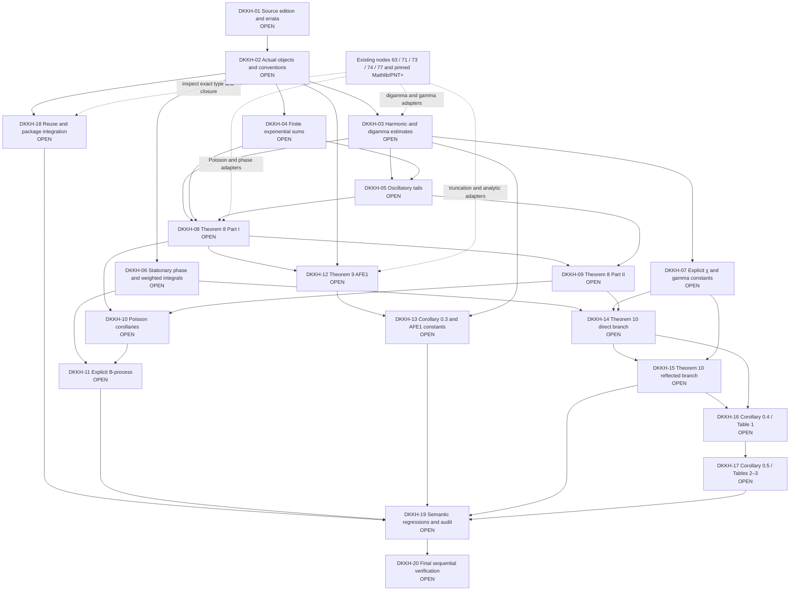

# Proof architecture

**PLANNING ONLY. 0/20 proof gates complete.** All numbered nodes are future obligations. Existing proved libraries feed these nodes through adapters; no edge denotes a new installed import.

Source review precedes a fixed Lean signature. The two Poisson estimates are substantive independent outputs; an AFE specialization alone does not close the general theorem. The reflected AFE branch must consume the actual direct-branch remainder and χ identity. Numerical certification follows the analytic assembly. Preserve the distinct scaffold, development and release statuses.
