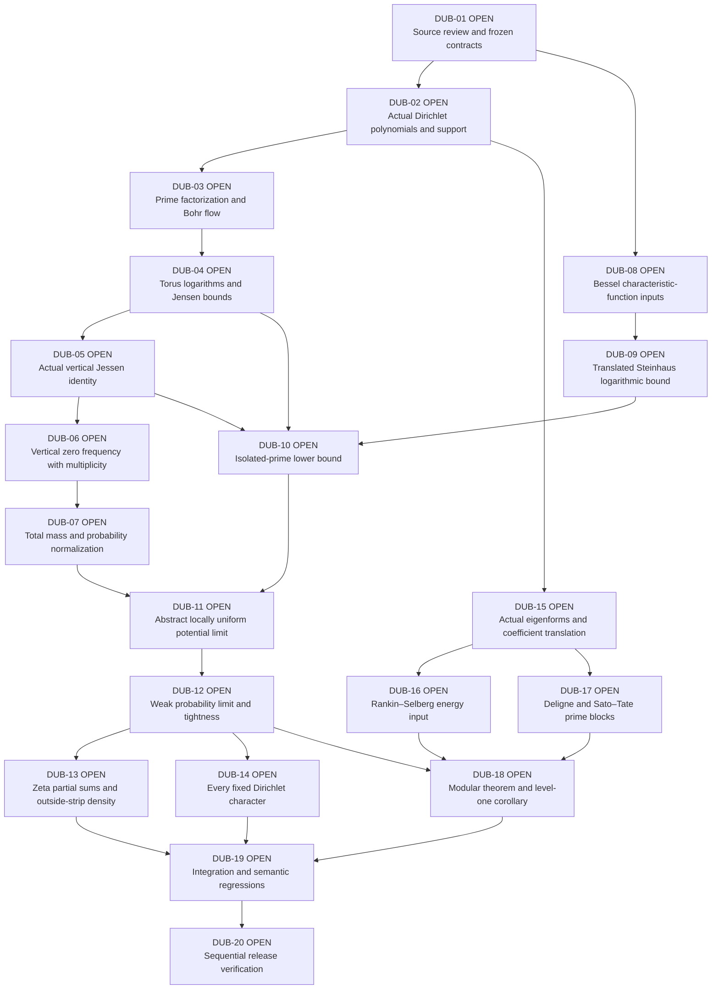

# Dubon 2026 — proof architecture

**GOAL ACTIVE — 0/20 proof gates complete.** Every diagram node corresponds to the same OPEN acceptance gate in the Checklist and machine-readable registry. DUB-02 has the actual polynomial/support and multiplicity layer. DUB-03 has the prime-log independence and continuous-test equidistribution proofs. DUB-04 has the multivariate Haar logarithm, zero-set, energy and Jensen proofs; the vertical-mean identification belongs to DUB-05. No complete source gate has yet been accepted; all diagram nodes remain OPEN.

The Jessen/zero-measure branch and the Bessel/Steinhaus branch meet in the abstract concentration theorem. Zeta and character specializations can consume that theorem once their arithmetic inputs are proved. The modular specialization additionally depends on actual eigenform objects and audited Rankin–Selberg, Deligne and Sato–Tate inputs. DUB-19/DUB-20 require all three application branches.

DUB-05 implementation detail: `JessenMean.tendsto_verticalLogMean_haar` proves the fixed-N symmetric logarithmic mean equals the normalized Haar log integral for every real σ, assuming N≥1 and a₁≠0. The proof derives nonzero finite jets for every genuine prime twist, obtains a finite compact cover, proves a uniform sublevel measure estimate, integrates its exponential logarithmic deficit, and controls truncation errors uniformly over all T≥1. `jessenFunction` is defined by the actual vertical limit; `jessenFunction_eq_haar` and `jessenFunction_bounds` identify it and prove 0≤J≤log(E)/2 when a₁=1. `JessenConvexity` also proves convexity and continuity: finite product-grid averages converge uniformly for continuous torus tests, analytic products of actual prime twists satisfy Hadamard three-lines, and their Haar logarithms equal the number of factors times the original potential. `SemanticRegression.bohr_jessen_proposition_source` assembles the full Proposition 3.3 conclusion. The zero-frequency formula and concentration applications remain open; DUB-05 acceptance still depends on upstream source-review acceptance. The logarithmic singularity is controlled by a proved uniform estimate. All diagram/checklist gates remain OPEN.

DUB-07 implementation detail: `JessenStieltjes` constructs the positive Stieltjes measure of the actual convex Jessen function. `ConvexDerivatives` proves right continuity of the right derivative and identifies its left limit with the left derivative, so open intervals and atoms have the exact one-sided formulas. `LeadingBohrTerm` proves terminal-term dominance uniformly on the torus; `JessenLeftLimit` and `JessenRightLimit` derive both endpoint asymptotes and derivative limits. `JessenMass` proves total mass log M, the 1/(2π) scaling, probability normalization for M>1 and the zero measure for M=1. `PeriodicMean`, `BinomialJessen`, `BinomialMeasure`, `BinomialZeros` and `BinomialZeroCount` prove the source’s general λ>0 normalization example: the actual logarithmic limit is max(0,−λσ), its Stieltjes second derivative is λδ₀, the actual zeros are (2m+1)πi/λ with multiplicity one, and their symmetric density is λ/(2π). The example also has the exact open-strip count/measure limit, including endpoints at its atom. `IsolatedPrimeSupport` now derives eventual coefficient nonvanishing, N/2<M_N≤N, M_N>1, M_N→∞ and log M_N/log N→1 from the literal compact-interval comparability in H2 and growing isolated prime blocks. It consumes the proved mass theorem to obtain actual probability measures for all sufficiently large N. The general multiplicity-weighted zero-frequency identity remains open. These measure results do not by themselves identify vertical zero frequencies; DUB-07 remains OPEN.

DUB-06 implementation detail: `DirichletDivisor` and `RectangleZeroCount` consume the existing foundation’s `GuthMaynardExternal.PNT.RectangleArgumentPrinciple`: the divisor weights are proved equal to actual analytic multiplicities, and the normalized contour integral equals the literal open-rectangle count when the boundary is nonvanishing. `ZeroFreeBoundaries` derives arbitrarily high admissible heights from the actual countable zero set. `ZeroFreeHalfPlanes` places all zeros in a bounded vertical strip. `JensenZeroBound`, `UniformTwistZeroBound`, `VerticalZeroTranslation` and `UniformLocalZeroCount` derive a multiplicity bound uniform over every translated unit-height window, using actual prime twists and preserved analytic orders. `ZeroCountHeight` proves monotonicity and bounded unit changes of the height cutoff. `HeightLimitTransfer` derives a linear count bound and proves that moving to selected heights in [T,T+1] preserves a density limit. It also derives a zero-free contour selection and transfers a limit of its normalized contour integral to all heights; the contour limit is an explicit narrower hypothesis and is not yet proved. These are source-facing count and contour bridges; the Jessen–Tornehave long-height limit, including arbitrary open-strip endpoints, remains OPEN under DUB-06.

`BesselJ0` defines the literal source power series and proves its convergence and equality with the normalized circle integral. `CircleCharacteristic`, `CircleMoments`, `CircleGaussian` and `CircleSeries` supply reality, continuity, strict modulus below one for nonzero arguments, exact second moment and the bound |J₀(u)|≤exp(−u²/π²) for |u|≤1. `CircleQuarter`, `CircleOscillation` and `BesselDecay` consume the existing foundation’s nonstationary-phase theorem and prove |J₀(u)|≤(4+1/π)u^(−1/2) for u≥1. `CircleRadial` identifies the actual Haar characteristic function in every complex direction and derives the negative-sign 2π Fourier convention. The two unfolded source consumers assemble these statements. The 70-module sequential build and exhaustive audit passed. DUB-08 remains OPEN pending upstream source-review acceptance; the translated Steinhaus bound and abstract analytic concentration criterion are implemented; the concrete arithmetic applications remain unproved.

DUB-09 supporting implementation: `SteinhausLaw` constructs the actual finite weighted Haar sum, its probability pushforward and its Bessel-product characteristic function. `SteinhausNormalization` starts from the actual max/min coefficient ratio and derives the positive quadratic scale, unit energy and normalized coefficient bounds. `SteinhausRegionBounds` and `SteinhausRegions` prove the Gaussian, compact-gap and power-tail pointwise estimates at the exact source cutoffs. `RadialTailIntegral` and `RadialInnerIntegrals` prove the Gaussian and annular integrals, the exact power-tail integral and its dimension-uniform m≥5 bound. `ThreeRegionIntegral` and `SteinhausRadialIntegral` assemble the actual three-region integral estimate. `PolarRadialIntegral` proves the exact 2π planar factor and integrability transfer; `SteinhausFourierL1` obtains one L¹ constant depending only on K, simultaneously for every finite dimension m≥5 and every admissible coefficient vector. `uniform_steinhaus_planar_L1_source` unfolds the real probability pushforward and normalization. `InverseCharacteristic` and `PlanarGaussian` establish the normalized inverse integral and exact Gaussian inversion. `InverseCharacteristicMeasure`, `GaussianDensityLimit`, `GaussianTestKernel`, `GaussianSmoothingBounds` and `GaussianTestPairing` prove the convolution identity, positivity and equality on every compact continuous test. `PlanarDensity` identifies the original finite measure with this continuous bounded density. `PlanarSmallBall` proves all translated disk bounds and zero-set nullity. `SteinhausDensity` chooses one density/small-ball constant before all dimensions, coefficient vectors, translations and radii; the new source consumer unfolds both the probability pushforward and the inverse integral. `SmallBallLog` derives negative-log integrability by layer cake from the actual disk bound; `BoundedLogExpectation` proves full logarithmic integrability and the lower expectation bound. `SteinhausLogNormalized` applies these to every translated normalized Haar sum. `SteinhausLogScale` restores the exact scale S=√(Σbᵢ²) using proved zero-set nullity. `SteinhausIndependentLaw` identifies the weighted-sum law for arbitrary independent variables with actual uniform circle marginals, and `SteinhausLog` proves the full source conclusion on every probability space. The constant is chosen before m≥5, the positive K-comparable coefficients, the probability space, the variables and the translation. Two additional source consumers unfold the max/min ratio, scale, finite sum and circle law. DUB-09 remains OPEN pending upstream review and acceptance verification; its logarithmic source conclusion is now implemented. The six-module logarithmic expansion passed its aggregate audit and sequential foundation/paper verification with zero diagnostics. This ten-module expansion brings the root to 90 modules; its aggregate audit and sequential foundation/paper verification passed with zero diagnostics. The 80-module aggregate audit and sequential foundation/paper verification passed with zero diagnostics; their exact scope is recorded in the Reproduction Manifest.

DUB-10 implementation: `IsolatedPrimeMonomials` proves that a selected prime in (N/2,N] occurs only in its own term. `IsolatedBohrDecomposition` and `IsolatedTorusSplit` derive the actual conditional Haar decomposition and preserve its product measure and logarithmic integral. `SteinhausPhases` removes arbitrary complex coefficient phases by Haar translation. `IsolatedHaarLower`, `PrimeSelection` and `IsolatedPrimeLower` consume these identities and the translated Steinhaus bound to prove Proposition 5.1 for the literal natural-number prime block, including its max/min ratio and one constant depending only on K. The compact-interval consumer derives the eventual uniform lower bound from the literal H2 comparability and growing prime blocks. Both finite-block and compact-uniform source consumers pass the exhaustive dependency audit. DUB-10 remains OPEN pending upstream review and acceptance; the general zero-frequency identity and concrete arithmetic applications remain unproved.

DUB-11 implementation: `PotentialPointwise` states the literal H1 and locally uniform H2 energy hypotheses and proves pointwise convergence of the actual Jessen function divided by log N. `JessenSlopeBounds` derives its global derivative and secant bounds from the proved affine asymptotes. `PotentialEquicontinuity` proves a common Lipschitz constant of one for every N≥2 and upgrades pointwise convergence to local uniform convergence on all of ℝ, including α. This proof uses the actual functions and does not add uniformity to H1. `abstract_potential_limit_source` unfolds the two energy sums and H2 comparability and pairs the local-uniform limit with the proved log M_N/log N limit. The weak probability conclusion is implemented; the general zero-frequency identity remains open. DUB-11 awaits acceptance verification and upstream review.

DUB-12 implementation: `ConvexDerivativeLimit` and `JessenDerivativeLimit` derive both one-sided derivative limits away from α from three actual potential values and convert log N to log M_N normalization. `JessenProbability` uses exactly J″/log M_N whenever M_N>1, with a declared Dirac convention at degenerate indices; H2 proves that every sufficiently large index uses the actual source measure. `JessenIntervalLimit` proves mass convergence to one on every open interval containing α. `NeighborhoodConcentration` proves tightness of the whole sequence, including its finite initial part, and applies the probability-measure Portmanteau theorem. `WeakLimit.abstract_jessen_concentration` assembles local uniform potential convergence, support normalization, tightness, weak probability convergence to δ_α, every bounded continuous test limit and eventual equality with the actual normalized Stieltjes measure. The unfolded `abstract_concentration_source` consumer retains the literal H1/H2 inputs and measure scaling. This is the abstract analytic criterion; its identification with general vertical zero frequencies remains OPEN under DUB-06, and the zeta, character and modular hypotheses are not yet discharged. DUB-12 remains OPEN pending upstream review and acceptance verification.

DUB-13 implementation: `DyadicPrimes` defines the exact open/closed source block and proves its cardinality equals π(N)−π(⌊N/2⌋). `PrimeCountingPNT` reuses the proved analytic block of Project 73’s frozen PNT consequences, above Project 63’s existing `GafniTaoNative` Wiener/PNT prefix. The raw PNT+ consequences module is not imported: its Wiener dependency replays two unproved declarations, whereas the selected local chain compiles without those diagnostics. `PrimeCountAsymptotics` derives the inclusive count at cN for every fixed c>0 and the dyadic limit (1/2)N/log N. `LogarithmicScale` and `DyadicPrimeGrowth` prove growth of the actual block and log(card Q_N)/log N→1. The unfolded dyadic source consumer is registered. The zeta energy and uniform coefficient hypotheses still require proofs; DUB-13 remains OPEN.
