```mermaid
flowchart TD
    S00["PSH-00 Isolation boundary<br/>DONE: frozen GM and pinned Zeta23 unchanged"]
    S01["PSH-01 Pinned Zeta23 reproduction<br/>DONE WITH IMMUTABLE UPSTREAM<br/>warnings recorded, not suppressed"]
    S02["PSH-02 Exact source crosswalk<br/>DONE: paper statements, Lean declarations,<br/>normalizations and nonmatches explicit"]
    S03["PSH-03 Exact prime-prime decomposition<br/>DONE: all frequency pieces accessible;<br/>published bound recovered as regression"]
    S04["PSH-04 Exact dyadic shift kernel<br/>DONE: literal m=n+h rewrite,<br/>endpoints and variation retained"]
    S05["PSH-05 Narrow finite arithmetic interfaces<br/>DONE AS SPECIFICATIONS AND CONSUMERS<br/>no arithmetic oracle postulated"]
    S06["PSH-06 Concrete F1 verdict<br/>DONE: actual pinned PhiR rows vary;<br/>collapsed-prefix transfer fails"]

    FIX["Correction of provisional F2 claim<br/>DONE: zero gap belongs to amplitude q,<br/>not to a strictly-positive WindowProfile v"]
    AFE["Faithful amplitude source entry<br/>DONE: atV(q²), C³ even bounded q,<br/>extended FamilyHyps proved"]
    BAND["Explicit two-band amplitude<br/>DONE: smooth, nonnegative, nonzero,<br/>exact difference-set support"]
    NONEMPTY["PSH-07 Faithful shell admissibility<br/>DONE AND NONEMPTY<br/>concreteFaithfulAmplitudeShell"]
    HOLDER["Exact spectral support-loss inequality<br/>DONE: Cauchy-Schwarz plus D1 nonnegativity"]
    F3["PSH-09 F3 universal pricing verdict<br/>DONE: every faithful separated shell has<br/>kappaXi > 3 and no positive gain"]
    TERM["TERMINAL B: ROUTE DISPROVED<br/>primeShell_universal_no_gain_native<br/>faithfulSeparatedAmplitudeGain_iff_false"]

    S08["PSH-08 Exact arithmetic consumers<br/>PRESERVED: literal two-variable interfaces;<br/>irrelevant to terminal obstruction"]
    MRT["Published arithmetic routes<br/>NOT FORMALIZED AS PROJECT AXIOMS<br/>full-chain/MRT scale overlap is nonempty"]
    S10["PSH-10 Exposition<br/>DONE FOR THE NO-GO ENDPOINT"]
    S11["PSH-11 Native arithmetic source<br/>CLOSED NOT REQUIRED BY TERMINAL B"]
    S12["PSH-12 Integration architecture<br/>DONE: isolated Lean 4.33 extension;<br/>frozen Lean 4.30 GM root untouched"]
    S13["PSH-13 Native arithmetic input<br/>CLOSED NOT REQUIRED BY TERMINAL B"]
    S14["PSH-14 Native weighted trace<br/>CLOSED NOT REQUIRED BY TERMINAL B"]
    S15["PSH-15 Native zero-side success chain<br/>CLOSED NOT REQUIRED; no zero theorem claimed"]
    S16["PSH-16 Public terminal theorem<br/>DONE: non-vacuous universal no-gain"]
    S17["PSH-17 Dependency audit<br/>DONE: permitted logical axioms only"]
    S18["PSH-18 Project-source clean check<br/>DONE: zero Prime Shell diagnostics;<br/>immutable dependency warnings disclosed"]
    S19["PSH-19 Trusted statement check<br/>DONE: gain existence iff False"]
    S20["PSH-20 Reproduction candidate<br/>DONE: exact pins, isolated build,<br/>source SHA-256 manifest"]
    S21["PSH-21 Independent expert review<br/>OPEN - EXTERNAL"]

    S00 --> S01 --> S02 --> S03 --> S04 --> S05 --> S06 --> FIX
    FIX --> AFE --> BAND --> NONEMPTY --> HOLDER --> F3 --> TERM
    S04 --> S08
    S08 --> MRT
    TERM --> S10 --> S11 --> S12 --> S13 --> S14 --> S15 --> S16
    S16 --> S17 --> S18 --> S19 --> S20 --> S21

    classDef done fill:#d7f5dd,stroke:#187a2f,color:#102814,stroke-width:2px;
    classDef closed fill:#ececec,stroke:#666,color:#222,stroke-width:2px;
    classDef stop fill:#ffd9d9,stroke:#a32121,color:#3d0b0b,stroke-width:2px;
    classDef external fill:#dcecff,stroke:#245b9e,color:#0d2542,stroke-width:2px;
    class S00,S01,S02,S03,S04,S05,S06,FIX,AFE,BAND,NONEMPTY,HOLDER,F3,S08,MRT,S10,S12,S16,S17,S18,S19,S20 done;
    class S11,S13,S14,S15 closed;
    class TERM stop;
    class S21 external;
```

The terminal theorem concerns the faithful separated-amplitude mechanism formalized here. It does not rule out connected positive-valley windows, a different source construction, or other approaches to zero statistics.
