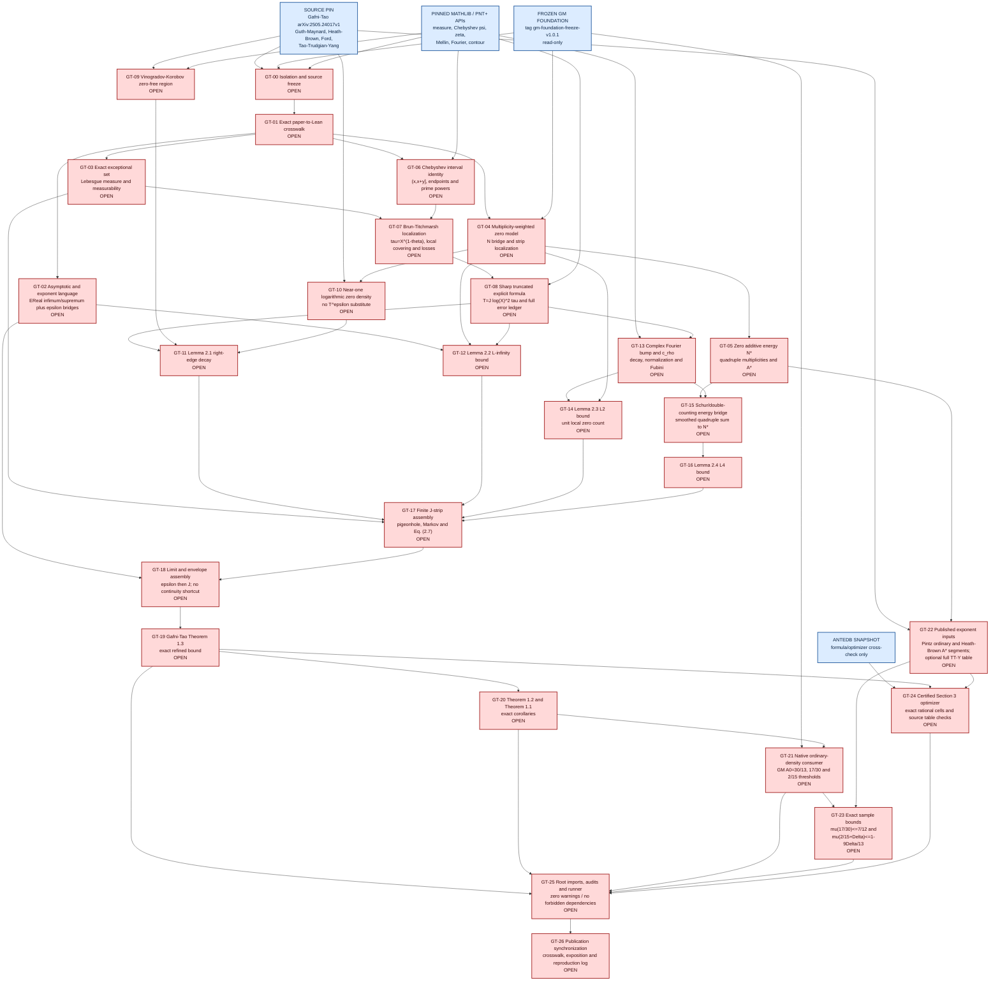

# Gafni-Tao Lean architecture

Status: proposed architecture. Every numbered `GT-*` proof node is open.

The graph is ordered by proof dependency, not by estimated difficulty. The
frozen Guth-Maynard package is an imported dependency and remains read-only.

## Proposed isolated Lean modules

The implementation should be a separate package at
`PostGM/GafniTao/Extension/`, pinned to the frozen foundation rather than the
moving workspace root.

| Module | Owns |
| --- | --- |
| `GafniTao.Asymptotics` | parameter-dependent big-O, epsilon-power bounds, `EReal` exponent infima/suprema and limiting bridges |
| `GafniTao.ExceptionalSet` | exact `(x,x+x^theta]` Mangoldt discrepancy, measurable exceptional set, `mu_delta`, `mu` |
| `GafniTao.Zeros` | frozen `N` bridge, multiplicity-weighted finite zero sums, real-part strips |
| `GafniTao.ZeroEnergy` | exact `N*`, `A*`, monotonicity and finite-energy bridges |
| `GafniTao.ChebyshevIntervals` | `psi` difference identity, floor/endpoints and prime powers |
| `GafniTao.BrunTitchmarsh` | local replacement of `x^theta` by `x/tau` and finite covering |
| `GafniTao.ExplicitFormula` | sharp truncated formula and all boundary/error terms |
| `GafniTao.NearOne` | Vinogradov-Korobov region, logarithmic density, Lemma 2.1 |
| `GafniTao.ZeroSumSup` | equation (2.4) and Lemma 2.2 |
| `GafniTao.ZeroSumL2` | complex Fourier bump, coefficient bounds, local zero count, Lemma 2.3 |
| `GafniTao.ZeroSumL4` | pair-count function, Schur test, `N*` bridge, Lemma 2.4 |
| `GafniTao.RefinedBound` | equations (2.1)-(2.7), strip split, Markov, limits, Theorems 1.2-1.3 |
| `GafniTao.NativeInputs` | actual frozen GM and published Pintz/Heath-Brown/TT-Y consumers |
| `GafniTao.Corollaries` | Theorem 1.1 thresholds and exact Section 3 sample bounds |
| `GafniTao.Optimizer` | optional exact rational certification of the complete Section 3 table/figure envelope |
| `GafniTao.Audit` | explicit `#print axioms` list for every public and agenda-critical theorem |
| `GafniTao.lean` | imports every production module in the isolated package |

## Public acceptance layer

Names may change after exact type design, but the final public layer must contain
the following mathematical objects rather than theorem-equivalent hypotheses:

- `shortIntervalExceptionalSet delta X theta` with Lebesgue measure;
- `exceptionalExponentDelta delta theta` and `exceptionalExponent theta`, with
  the paper's empty-set/`-infinity` convention;
- `zeroDensityExponent sigma` for the actual multiplicity count `N`;
- `zeroAdditiveEnergyCount sigma T` and `zeroAdditiveEnergyExponent sigma` for
  the actual four-zero count;
- `gafniTao_refined_bound_native`, equivalent to Theorem 1.3;
- `gafniTao_general_bound_native`, equivalent to Theorem 1.2;
- `gafniTao_zero_density_short_intervals_native`, equivalent to Theorem 1.1;
- `gafniTao_seventeen_thirtieth_native` proving
  `mu(17/30) <= 7/12`;
- `gafniTao_near_two_fifteenths_native` proving the quantified small-positive-
  `Delta` bound `mu(2/15+Delta) <= 1-9 Delta/13`.

A theorem parameter may expose a narrower source estimate while developing a
consumer, but a node is not done until the final native theorem derives that
estimate from the actual formalized source input.
