# Prime Shell Architecture

Status: planning complete; mathematical and Lean execution open.

The graph separates source reproduction, mathematical feasibility, and formal proof. A negative result at either feasibility gate is a legitimate terminal result for that route. It is not converted into a theorem-completion claim.

```mermaid
flowchart TD
    S00["PSH-00 Isolation boundary<br/>DONE: research subtree only"]
    S01["PSH-01 Reproduce pinned Zeta23 v1.0<br/>OPEN"]
    S02["PSH-02 Exact paper-to-Lean crosswalk<br/>OPEN"]
    S03["PSH-03 Expose exact M[P_X,P_X]<br/>diagonal and off-diagonal terms<br/>OPEN"]
    S04["PSH-04 Dyadic m=n+h rewrite<br/>and explicit K_N,T(h)<br/>OPEN"]
    S05["PSH-05 Exact GM cumulative-correlation<br/>source interface and error ledger<br/>OPEN"]
    F1{"PSH-06 F1: Does prefix information<br/>control the exact weighted kernel?"}
    N1["Record rigorous GM-route no-go<br/>and preserve reusable decomposition"]
    S07["PSH-07 F2: disconnected-shell<br/>admissibility and cross terms<br/>OPEN"]
    S08["PSH-08 Arithmetic-only<br/>oracle consumer<br/>OPEN"]
    F3{"PSH-09 F3: certified pricing gives<br/>a meaningful new zero theorem?"}
    N2["Stop shell route<br/>record strongest certified bound"]
    S10["PSH-10 Complete informal proof<br/>with all constants and errors<br/>OPEN"]
    S11["PSH-11 Select GM or MRT<br/>from proved gate verdicts<br/>OPEN"]
    S12["PSH-12 Toolchain/integration decision<br/>without modifying frozen GM<br/>OPEN"]
    S13["PSH-13 Formalize native arithmetic input<br/>OPEN"]
    S14["PSH-14 Replace oracle in exact trace<br/>OPEN"]
    S15["PSH-15 Spectral/inertia consumer<br/>OPEN"]
    S16["PSH-16 New unconditional<br/>Prime Shell zero theorem<br/>OPEN"]
    S17["PSH-17 Dependency audit<br/>OPEN"]
    S18["PSH-18 Zero-warning clean build<br/>OPEN"]
    S19["PSH-19 Trusted statement check<br/>OPEN"]
    S20["PSH-20 Reproducible immutable release<br/>OPEN"]
    S21["PSH-21 Independent expert review<br/>OPEN - EXTERNAL"]
    MRT["Fallback: MRT almost-all shifts<br/>threshold alpha > 33/25"]
    CEIL["PSH-C Optional ceiling audit<br/>reproduce EnclOK before using 0.6818287<br/>as a verified numerical comparator"]

    S00 --> S01 --> S02 --> S03 --> S04 --> S05 --> F1
    F1 -->|NO| N1
    F1 -->|YES| S07 --> S08 --> F3
    F3 -->|NO| N2
    F3 -->|YES| S10 --> S11 --> S12 --> S13 --> S14 --> S15 --> S16 --> S17 --> S18 --> S19 --> S20 --> S21
    N1 --> MRT --> S07
    CEIL -. optional scoreboard .-> F3

    classDef done fill:#d7f5dd,stroke:#187a2f,color:#102814,stroke-width:2px;
    classDef open fill:#dcecff,stroke:#245b9e,color:#0d2542,stroke-width:2px;
    classDef gate fill:#fff2bf,stroke:#9a6a00,color:#332500,stroke-width:2px;
    classDef stop fill:#ffd9d9,stroke:#a32121,color:#3d0b0b,stroke-width:2px;
    class S00 done;
    class S01,S02,S03,S04,S05,S07,S08,S10,S11,S12,S13,S14,S15,S16,S17,S18,S19,S20,S21,MRT,CEIL open;
    class F1,F3 gate;
    class N1,N2 stop;
```

## Numbered execution steps

1. **PSH-00 - Enforce isolation.** Keep all new planning and experimental code under this subtree or in a separately pinned external checkout. The frozen GM modules are read-only inputs.
2. **PSH-01 - Reproduce Zeta23.** Check out exact commit `3635e748...`, build it unchanged with its own Lean/Mathlib pins, run its Comparator and axiom audit, and record commands and results.
3. **PSH-02 - Build the source crosswalk.** Map paper equations (2.7), (5.10), (5.11), Proposition 5.4, Theorem 5.7, and Section 7.2 to exact Lean declarations and definitions. Record endpoint, Fourier, and normalization conventions.
4. **PSH-03 - Open the prime-prime term.** Produce an exact equality for `M[P_X,P_X]` whose diagonal, near off-diagonal, opposite-sign off-diagonal, and boundary errors remain separately accessible. Recover the existing `X <= T` result from it.
5. **PSH-04 - Derive the physical kernel.** On dyadic `n ~ N`, rewrite the resonant contribution with `m = n + h` and retain the literal kernel `K_{N,T}(h)`. Prove support, size, regularity, variation, and tail bounds rather than replacing it by a generic bounded weight.
6. **PSH-05 - Specify the arithmetic input honestly.** Derive the exact cumulative correlation statement that GM Corollary 1.4 could supply after the `pi`-to-`psi` conversion, prime-power removal, exceptional-set weighting, endpoint repair, and uniformity checks. Keep all errors explicit.
7. **PSH-06 - Run F1.** Prove that the cumulative estimate controls the exact weighted kernel by Abel/summation-by-parts and bounded variation, or give a concrete counterexample/no-go theorem showing that additional local or phase-uniform information is required. This is the next persistent goal.
8. **PSH-07 - Run F2.** Only after F1 passes, prove that the test-function and trace framework admits a disconnected low block plus high shell and control every low-shell cross term.
9. **PSH-08 - Build the arithmetic-only oracle consumer.** Insert only a narrowly stated finite von Mangoldt estimate into the exact trace and zero-side consumer. The hypothesis must be strictly narrower than the zero conclusion and must not mention zero statistics.
10. **PSH-09 - Run F3.** Optimize the resulting finite spectral problem with certified arithmetic and decide whether the attainable theorem is worth formalizing.
11. **PSH-10 - Complete the paper proof.** Write a referee-grade proof with all parameter ranges, error budgets, and uniform dependencies before formalizing a new external theorem.
12. **PSH-11 - Select the arithmetic source.** Use GM only if its cumulative information passed the gates; otherwise test MRT and record a justified CONTINUE/STOP decision.
13. **PSH-12 - Choose integration architecture.** Decide between a standalone Zeta23-toolchain extension and a proved cross-project statement bridge. A wholesale port is disallowed unless it has a demonstrated consumer.
14. **PSH-13 - Formalize the arithmetic theorem.** Formalize only the source result shown sufficient by F1-F3, recursively proving missing dependencies without altering frozen GM declarations.
15. **PSH-14 - Remove the oracle.** Compose the native arithmetic theorem with the exact kernel and prime-side trace.
16. **PSH-15 - Complete the zero-side consumer.** Feed the new trace information through the actual finite compression, inertia, rank, multiplicity, and window machinery.
17. **PSH-16 - State the new zero theorem.** The theorem must be unconditional, kernel-checked, and demonstrably unavailable to the explicitly defined support-one certificate class. No numerical threshold is promised in advance.
18. **PSH-17 - Audit dependencies.** Audit every public and agenda-critical theorem and reject `sorryAx`, project axioms, theorem-equivalent assumptions, and unsafe proof bypasses.
19. **PSH-18 - Require a clean build.** The isolated project must compile with zero Lean warnings and linter diagnostics.
20. **PSH-19 - Check the trusted statement.** Use Comparator or an equivalent independent statement-equality check for the public result.
21. **PSH-20 - Release reproducibly.** Run fresh-clone verification and bind source, manifests, commands, and evidence to an immutable SHA.
22. **PSH-21 - Seek external review.** Separate kernel acceptance from independent mathematical and expository review.

## Scale checkpoints

For `N = T^alpha`, the resonant shift length is `H_res ~ N/T = N^(1 - 1/alpha)`.

- GM threshold `H >= N^(2/15 + epsilon)` overlaps only with a strict epsilon margin beyond `alpha = 15/13`.
- MRT threshold `H >= N^(8/33 + epsilon)` overlaps only with a strict epsilon margin beyond `alpha = 33/25`.

These are feasibility thresholds, not support theorems.
