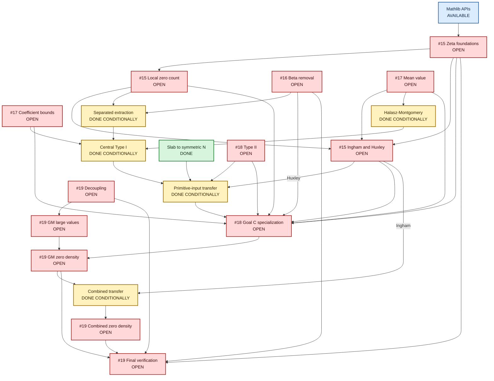

# Proof Architecture

**Last synchronized:** 8 August 2026

**Task authority:** `Lean Alignment Fix Agenda.md`

**Progress authority:** `Research Agenda Progress.MD`

This is the canonical logical dependency map for the proof, not an import graph.

## Part 1 — Explanation

### Status key

- **Blue — available:** existing Mathlib foundations.
- **Green — done:** kernel-checked at the stated boundary.
- **Amber — done conditionally:** the deduction is kernel-checked, while one or more upstream inputs shown in red remain open.
- **Red — open:** unfinished work. Every red node names its owning Shitlist item.

### Node details

| Node | Meaning and principal files |
|---|---|
| Zeta foundations | **#15:** `ZeroCount.lean`; growth, functional-equation, convexity, and Euler-product lower bounds. |
| Local zero count | **#15:** `ExtractSeparated.lean` or a focused supporting module; Jensen's formula and analytic multiplicity. |
| Density endpoints | **#15:** `InghamBound.lean`; concrete Ingham and Huxley estimates for `N`. |
| Beta removal | **#16:** `BetaDependence.lean`; Fourier decay, contour shifting, truncation, averaging, and pigeonholing. |
| Coefficient bounds | **#17:** `ZeroDetector.lean` and `PolynomialPowers.lean`; divisor and factorization estimates. |
| Mean value | **#17:** `MeanValue.lean`; Montgomery's estimate on `[0,T]`. |
| Type-II inputs | **#18:** `TypeIIZeros.lean`; coverage, fourth-moment reduction, and twisted zeta fourth moment. |
| Goal C specialization | **#18:** transfer integration producing a theorem whose only remaining premise is `GuthMaynardLargeValues`. |
| Decoupling and GM large values | **#19:** `Decoupling.lean` and `LargeValues.lean`. |
| Final results and gates | **#19:** concrete Guth–Maynard and combined zero-density theorems, `Audit.lean`, documentation, and `run_lake_build.bat`. |

The completed conditional path consists of the #13 separated extraction, the Halász–Montgomery deduction, the #14 central Type-I estimate, the slab-to-symmetric-count transfer, the #14 primitive-input transfer, and the combined-exponent transfer.

The dependency-respecting order is **#15 foundations → #17 → finish #15 density endpoints**. #16 can proceed independently before #18; #18 must produce the Goal C specialization before #19 can apply the proved large-values theorem and close the project.

An item is crossed out only when every red node bearing its number is kernel-checked and its Shitlist completion test passes.

### Synchronization rule

Any change to proof status, open obligations, dependency edges, or Shitlist numbering must update these three artifacts together:

1. `Lean Alignment Fix Agenda.md` — authoritative task number, scope, and completion test;
2. `Research Agenda Progress.MD` — evidence-based current assessment; and
3. this Mermaid diagram — matching node status and dependencies.

No unfinished diagram node may omit its Shitlist number. No crossed-out item may retain a red node. No new red node may be added without assigning it to one of the five exhaustive remaining items unless the project owner explicitly changes the completion contract.

## Part 2 — Diagram

